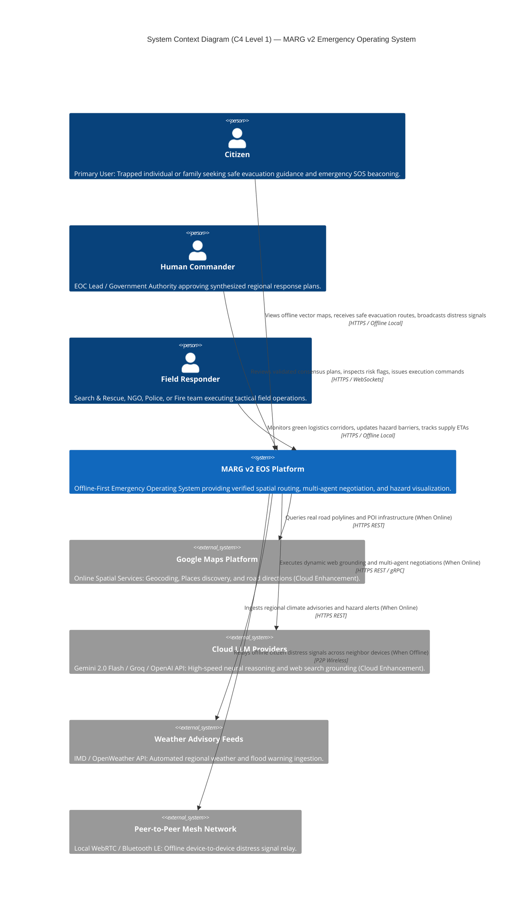
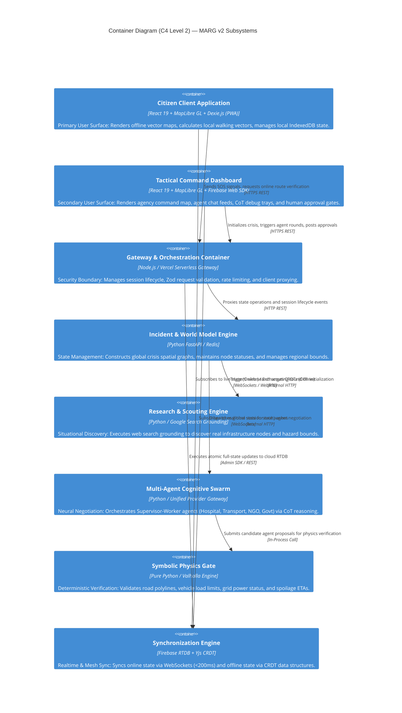
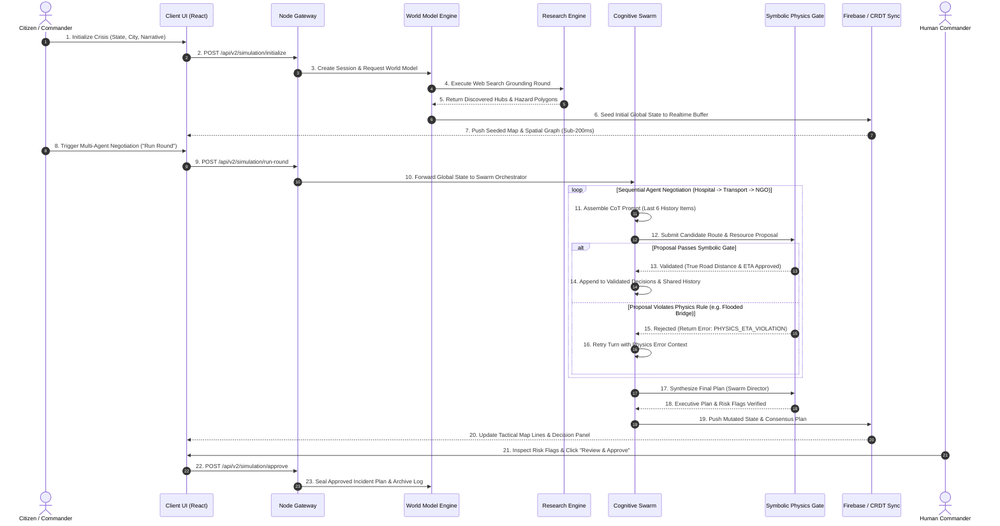

# MARG v2 — Phase 1: System Architecture Blueprint

## Document Metadata
- **Document Title**: SYSTEM_ARCHITECTURE.md (Phase 1 Architecture Specification)
- **Project Name**: MARG v2 (Multi-Agent Routing and Guidance)
- **Role**: Principal Systems Architect, Distributed Systems Architect & Technical Design Authority
- **Status**: Phase 1 Architecture Blueprint — Single Source of Architectural Truth
- **Authoritative Context Baseline**: Derived strictly from [`docs/10_DISCOVERY/PHASE0.md`](../10_DISCOVERY/PHASE0.md)
- **Constraint Compliance**:
  - [x] Zero implementation code, APIs, or database DDL statements
  - [x] Zero code generation or folder creation outside `docs/20_ARCHITECTURE/`
  - [x] Full traceability to Phase 0 Constitution, Functional, and Non-Functional requirements
  - [x] All unresolved decisions explicitly tagged as `PROVISIONAL`

---

# 1. Executive Summary

## 1.1 Architectural High Concept
**MARG v2 (Multi-Agent Routing and Guidance)** is an open-source, offline-first **Emergency Operating System (EOS)** designed to safeguard civilian lives and coordinate response organizations during severe disasters. 

Unlike traditional centralized emergency software designed exclusively for government command centers, MARG v2 operates from a **Citizen-First System Paradigm**. It prioritizes bottom-up civilian survival guidance—providing offline maps, hazard evacuation vectors, and emergency beaconing directly on citizen devices—before synthesizing top-down organizational logistics for emergency agencies.

## 1.2 The Neurosymbolic Operating Philosophy
MARG v2 addresses a critical flaw in modern artificial intelligence: standard neural Large Language Models (LLMs) hallucinate. In a emergency situation, an AI hallucinating an open road, a non-existent relief bridge, or an unverified delivery ETA can cause civilian casualties.

To eliminate this vulnerability, MARG v2 implements a strict **Neurosymbolic Dual-Engine Architecture**:
1. **Neural Cognitive Layer**: Large Language Models and web-grounded research agents provide dynamic situational awareness, unstructured data extraction, and multi-agent resource negotiation.
2. **Symbolic Verification Layer**: Zero-AI, deterministic engines strictly validate 100% of candidate routes, vehicle capacities, travel times, and spatial hazard intersections before any recommendation is rendered to a human user.

```
┌─────────────────────────────────────────────────────────────────────────┐
│                      NEUROSYMBOLIC DUAL-ENGINE CORE                     │
│                                                                         │
│  ┌──────────────────────────────┐     ┌──────────────────────────────┐  │
│  │   NEURAL COGNITIVE LAYER     │     │  SYMBOLIC VERIFICATION GATE  │  │
│  │  - Web Grounding & Search    │     │  - Real Road Network Polylines│  │
│  - Multi-Agent Negotiation    │ ──► │  - Vehicle Payload Limits    │  │
│  - CoT Reasoning & Narratives   │     │  - Hazard Polygon Intersect  │  │
│  └──────────────────────────────┘     └──────────────┬───────────────┘  │
│                                                      │                  │
│                                           (100% Validated Output)       │
│                                                      ▼                  │
│                                       [ Human Commander / Citizen ]     │
└─────────────────────────────────────────────────────────────────────────┘
```

## 1.3 How MARG v2 Differs From a Traditional AI Chatbot
A traditional AI chatbot is an unstructured, single-turn, cloud-dependent text generator that accepts a prompt and returns an unverified textual reply. 

MARG v2 is **not** a chatbot:
- **Operating Surface**: The primary interface is a **dynamic, offline-first spatial map canvas**, not a conversational text log.
- **Data Execution**: Information is structured as deterministic spatial graphs, vector tile layers, and agent state machines.
- **Physical Validation**: Neural recommendations are blocked by a hard symbolic physics gate if they violate road closures, battery deadlines, or vehicle payload caps.
- **Offline Autonomy**: Core mapping, pathfinding, and safety guidance function in a 100% cellular and cloud blackout.

---

# 2. Architectural Principles

Every subsystem, container, and component within MARG v2 must strictly adhere to six core architectural principles derived directly from the **Project Constitution** established in Phase 0.

## 2.1 Principle 1: Offline Primacy (Local-First Design)
- **Statement**: System capabilities must execute on local client hardware or edge gateways without requiring continuous internet or cloud availability.
- **Why It Exists**: Cellular towers and central power grids are the first infrastructure assets to fail during severe disasters. If an emergency app requires a cloud API call to render a map or calculate a route, it is useless when citizens need it most.
- **Derived From**: CP-03, NFR-OFF-01, NFR-OFF-02, TD-MAP-01, TD-OFF-01.

## 2.2 Principle 2: Zero-Hallucination Symbolic Verification Gate
- **Statement**: No neural AI model output may be displayed to a citizen or commander without passing through a zero-AI deterministic validation gate.
- **Why It Exists**: Human life is more important than model optimization. Statistical language models cannot guarantee 100% factual accuracy; symbolic validation ensures absolute physical compliance.
- **Derived From**: CP-01, CP-02, CP-06, FR-03, NFR-EXP-02.

## 2.3 Principle 3: Model-Agnostic Cognitive Decoupling
- **Statement**: The multi-agent cognitive engine must interact with LLMs strictly through an abstract provider-agnostic interface, supporting cloud APIs and local edge models seamlessly.
- **Why It Exists**: Prevents vendor lock-in and protects against cloud API rate limits, outages, or sudden pricing changes during a regional emergency.
- **Derived From**: CP-04, CP-09, FR-04, NFR-REL-01, TD-LLM-01.

## 2.4 Principle 4: Human-in-the-Loop Authority
- **Statement**: Autonomous agent swarms negotiate, optimize, and validate response plans, but final execution authorization remains exclusively with human commanders.
- **Why It Exists**: AI operates as an analytical force multiplier; accountability and legal/ethical command authority reside strictly with human leadership.
- **Derived From**: CP-01, CP-05, FR-05, NFR-EXP-01.

## 2.5 Principle 5: Progressive & Graceful System Degradation
- **Statement**: The architecture must gracefully step down capability layers as network bandwidth, cloud availability, or battery levels drop—never crashing or locking out the user.
- **Why It Exists**: System stability under extreme stress is paramount. A degraded vector map with simple walking paths is vastly superior to a crashed application.
- **Derived From**: CP-08, CP-10, NFR-AVAIL-01, NFR-REL-02.

## 2.6 Principle 6: Explainable Spatial & Narrative Reasoning
- **Statement**: Every recommended route, supply allocation, or priority score must provide human-inspectable reasoning traces and spatial justification.
- **Why It Exists**: Emergency responders and citizens must trust the system's instructions; black-box decisions breed hesitation and panic.
- **Derived From**: CP-05, FR-09, NFR-EXP-01.

---

# 3. System Context (C4 Level 1)

The C4 Level 1 Context Diagram defines MARG v2's boundary, illustrating its interactions with human users and external peripheral services.



---

# 4. Container Architecture (C4 Level 2)

The C4 Level 2 Container Diagram identifies the primary runtime containers that constitute MARG v2, detailing their individual responsibilities and inter-container communication channels.



---

# 5. Component Architecture (C4 Level 3)

Breaking down the core container subsystems into conceptual architectural components.

## 5.1 Citizen Application Container Components
- **Vector Map Rendering Component**: Manages WebGL map canvas, MapLibre tile style switching, and vector layer rendering.
- **Local Pathfinding Component**: Executes client-side Dijkstra/A* walking vector calculations over cached local road graphs.
- **IndexedDB Persistence Component**: Manages local storage of PMTiles map archives, offline emergency caches, and user profile state via Dexie.js.
- **Network State Observer Component**: Continuously monitors online/offline connection state and triggers graceful UI degradation modes.

## 5.2 Multi-Agent Cognitive Swarm Components
- **Swarm Orchestrator Component**: Controls sequential round execution (`Hospital` $\rightarrow$ `Transport` $\rightarrow$ `NGO` $\rightarrow$ `Govt`), enforcing 6-item context window slicing.
- **Domain Supervisor Components**: Domain-specific supervisors (Hospital, Transport, NGO, Government) that synthesize specialized worker agent proposals.
- **Unified LLM Provider Gateway Component**: Abstracts underlying model APIs (Gemini, Groq, OpenAI, Anthropic, Ollama) behind a single `LLMProviderInterface`.
- **Key Rotation & Fallback Component**: Tracks API key quotas and automatically switches to secondary keys or fallback providers upon encountering HTTP 429 errors.

## 5.3 Symbolic Physics Gate Components
- **Route & Polyline Evaluator Component**: Queries road network polylines (Valhalla/Directions API) and computes true road distances.
- **Hazard Spatial Interceptor Component**: Evaluates route polyline points against geofenced hazard polygons using ray-casting point-in-polygon tests.
- **Asset & Power Boundary Component**: Validates vehicle payload limits (e.g. drone 100-unit cap) and verifies power grid availability for electrical assets.
- **ETA & Spoilage Calculator Component**: Computes deterministic travel time and validates against the remaining time until medical supply spoilage.

---

# 6. Runtime Operating Modes

MARG v2 defines five explicit operating modes to guarantee graceful degradation across all network and power conditions.

```mermaid
graph LR
    Online Mode --> |Network Loss Detected| Emergency Mode
    Emergency Mode --> |Storage Cached| Offline Mode
    Offline Mode --> |Mesh Peer Found| Sync Mode
    Sync Mode --> |Cloud Restored| Recovery Mode
    Recovery Mode --> |State Merged| Online Mode
```

| Operating Mode | Purpose | Available Capabilities | Unavailable Capabilities | Transition Trigger / Condition |
| :--- | :--- | :--- | :--- | :--- |
| **Online Mode** | Full platform functionality with active cloud infrastructure. | High-res map tiles, Gemini web search grounding, cloud multi-agent swarms, sub-200ms Firebase RTDB sync. | None. | Default startup state when high-speed network connectivity is verified. |
| **Emergency Mode** | Operating during active cellular disruption or degraded bandwidth. | Local vector tiles, cached routing graphs, Groq/Ollama fast LLM fallbacks, local IndexedDB state. | High-bandwidth satellite imagery, live web search grounding. | Triggered when network latency exceeds 3,000ms or HTTP error rate exceeds 30%. |
| **Offline Mode** | 100% cloud blackout operation on local device. | MapLibre local PMTiles rendering, Dexie.js state, client-side Wasm pathfinding, local physics validation. | Cloud LLM APIs, Google Directions API, Firebase RTDB cloud sync. | Triggered immediately upon detection of zero network interface connectivity (`navigator.onLine == false`). |
| **Sync Mode** | Peer-to-peer data exchange during local blackout. | Local WebRTC / Bluetooth LE distress signal relay, local CRDT state merging. | Centralized cloud reporting. | Triggered when two or more offline devices detect local peer wireless range. |
| **Recovery Mode** | Re-establishing cloud link post-disaster. | Background CRDT reconciliation, automated session audit log upload to Postgres, cache refresh. | Real-time agent negotiation (paused during sync merge). | Triggered when cloud connectivity is restored after an offline emergency session. |

---

# 7. Incident Lifecycle Architecture

The sequence diagram below models the end-to-end operational lifecycle of an incident—from initial citizen distress or command initialization to verified plan execution.



---

# 8. System Data Flow Architecture

The conceptual data flow across MARG v2 is strictly unidirectional within execution loops, ensuring state immutability and complete auditability.

```
┌─────────────────┐     ┌─────────────────┐     ┌─────────────────┐
│  USER INPUT /   │ ──► │ WORLD MODEL &   │ ──► │ NEURAL SWARM    │
│  SCOUT SEARCH   │     │ SPATIAL GRAPH   │     │ PROPOSAL GENER  │
└─────────────────┘     └─────────────────┘     └────────┬────────┘
                                                         │
                                                         ▼
┌─────────────────┐     ┌─────────────────┐     ┌─────────────────┐
│ HUMAN APPROVAL  │ ◄── │ REALTIME CLIENT │ ◄── │ SYMBOLIC PHYSICS│
│ & MAP RENDERING │     │ STATE SYNC BFR  │     │ VALIDATOR GATE  │
└─────────────────┘     └─────────────────┘     └─────────────────┘
```

1. **Ingestion & Seeding Flow**: Unstructured crisis narrative $\rightarrow$ Research Grounding Agent $\rightarrow$ Spatial Entity Extractor $\rightarrow$ World Model State Graph.
2. **Cognitive Reasoning Flow**: World Model State $\rightarrow$ 6-Message History Slicer $\rightarrow$ Domain Agent CoT Prompt $\rightarrow$ Unified LLM Gateway $\rightarrow$ Raw Proposal JSON.
3. **Symbolic Verification Flow**: Raw Proposal JSON $\rightarrow$ Road Polyline Evaluator $\rightarrow$ Hazard Intersection Polygon Test $\rightarrow$ Capacity & ETA Validation $\rightarrow$ Validated Decision Array.
4. **Synchronization Flow**: Validated Decision Array $\rightarrow$ Full State Overwrite $\rightarrow$ Realtime Sync Buffer (Firebase RTDB / CRDT) $\rightarrow$ Client Map Canvas.

---

# 9. Failure Mode Architecture & Graceful Degradation

```
                         FAILURE DEGRADATION MATRIX
                         
┌───────────────────────────┐     ┌───────────────────────────┐     ┌───────────────────────────┐
│   CLOUD LLM API OUTAGE    │     │   GOOGLE MAPS UNREACHABLE │     │  COMPLETE NETWORK LOSS    │
│  - Auto-rotate API Keys   │     │  - Switch to Local OSRM / │     │  - Transition to Offline  │
│  - Fallback to Groq API   │     │    Valhalla Engine        │     │    MapLibre & Dexie DB    │
│  - Fallback to Local Edge │     │  - Use Haversine Buffer   │     │  - P2P Mesh Sync Active   │
└───────────────────────────┘     └───────────────────────────┘     └───────────────────────────┘
```

| Failure Event | Detection Mechanism | System Behavioral Response (Graceful Degradation) | Traceability |
| :--- | :--- | :--- | :--- |
| **Internet / Cellular Outage** | Browser `navigator.onLine == false` or WebSocket heartbeat drop. | Switches instantly to **Offline Mode**. MapLibre renders pre-cached PMTiles vector map from IndexedDB. Pedestrian pathfinding executes client-side. | CP-03, NFR-OFF-01 |
| **Cloud LLM Quota Exhaustion (429)**| HTTP 429 response from primary API provider. | Interceptor automatically rotates to secondary API key. If all keys exhausted, falls back to Groq API or local Ollama instance. | CP-04, NFR-REL-01, FR-10 |
| **Google Maps API Unreachable**| Timeout or HTTP 5xx from Directions API. | Physics gate automatically falls back to local Valhalla/OSRM routing engine or spatial Haversine distance calculations with penalty buffers. | CP-04, CP-08, NFR-REL-02 |
| **GPS Sensor Unavailability** | Geolocation API permission denied or signal loss. | Prompts citizen to tap their approximate landmark location manually on the interactive map canvas. | CP-07, CP-08 |
| **Database Sync Failure** | Firebase RTDB connection timeout ($> 3,000\text{ms}$). | Client UI displays "Local Mode Active" banner and caches mutations in local Dexie.js store until connection recovers. | CP-08, NFR-REL-02 |

---

# 10. Technology Confirmation & Traceability

In compliance with Phase 0 rules, all technology choices are explicitly confirmed against the research findings in [`docs/10_DISCOVERY/PHASE0.md`](../10_DISCOVERY/PHASE0.md).

| Domain | Problem | Confirmed Technology | Alternative Evaluated | Selection Rationale & Tradeoffs | Architectural Impact | Confidence | Traceability |
| :--- | :--- | :--- | :--- | :--- | :--- | :--- | :--- |
| **Client Mapping** | Offline interactive map rendering during blackouts. | **MapLibre GL JS + PMTiles** | Google Maps JS API | MapLibre + PMTiles allows rendering vector maps 100% offline from local storage. Tradeoff: Requires pre-caching tile packages. | Zero reliance on cloud tile servers for client mapping. | **High** | CP-03, FR-01, TD-MAP-01 |
| **Spatial Routing** | Dynamic pathing & hazard interception. | **Valhalla Engine** | OSRM / Google Directions | Valhalla natively supports dynamic edge weighting (speed penalties for flooded roads) and WebAssembly compilation. | Enables offline road graph physics validation. | **High** | CP-06, FR-03, Q3 |
| **Client Storage** | Persisting map tiles and local crisis state. | **Dexie.js (IndexedDB)** | SQLite Wasm | Dexie.js provides a clean, fast promise wrapper over browser-native IndexedDB supported in 99.9% of devices. | Stores gigabytes of offline vector tiles and local crisis states. | **High** | CP-03, NFR-OFF-01, TD-OFF-01 |
| **Realtime Sync** | Live state synchronization across dashboards. | **Firebase RTDB (Online) / Yjs CRDT (Offline)** | Socket.io | Firebase delivers sub-200ms cloud sync when online; Yjs CRDT enables peer-to-peer offline mesh sync. | Dual-mode state synchronization engine. | **Medium** | CP-04, FR-08, FR-13 |
| **Cognitive Engine** | Model-agnostic AI agent reasoning. | **Gemini 2.0 + Groq (Online) / Ollama (Offline)** | OpenAI GPT-4o only | Gemini provides native search grounding; Groq provides sub-second execution; Ollama runs offline on local hardware. | Complete decoupling of agent logic from specific vendors. | **High** | CP-09, FR-04, TD-LLM-01 |

---

# 11. Architectural Decision Records (ADR Summary)

| ADR ID | Title | Status | Primary Driver | Derived From (Traceability) |
| :--- | :--- | :--- | :--- | :--- |
| **ADR-001** | Offline-First Client Architecture | **Accepted** | Citizen survival during blackout | CP-03, NFR-OFF-01, FR-01 |
| **ADR-002** | Zero-AI Symbolic Physics Validation Gate | **Accepted** | Elimination of LLM route hallucinations | CP-01, CP-06, FR-03, NFR-EXP-02 |
| **ADR-003** | Model-Agnostic LLM Provider Abstraction | **Accepted** | Vendor decoupling and high availability | CP-04, CP-09, FR-04, NFR-REL-01 |
| **ADR-004** | Human-in-the-Loop Approval Authority | **Accepted** | Command accountability and ethics | CP-01, CP-05, FR-05 |
| **ADR-005** | MapLibre GL + PMTiles Vector Tile Engine | **Accepted** | Serverless offline map rendering | CP-03, CP-07, FR-01, TD-MAP-01 |
| **ADR-006** | Valhalla Routing for Hazard Penalty Costing| **Accepted** | Dynamic flooded road speed penalties | CP-06, FR-03, Q3 |
| **ADR-007** | Deterministic 6-Item History Windowing | **Accepted** | LLM context compression without hallucinated summaries | CP-11, CP-12, NFR-PERF-02 |
| **ADR-008** | Dual-Mode Sync (Firebase RTDB + Yjs CRDT) | **Accepted** | Online speed and offline P2P mesh sync | CP-03, CP-04, FR-08, FR-13 |
| **ADR-009** | Citizen-First UI Component Hierarchy | **Accepted** | Civilian evacuation priority over agency logs| CP-01, CP-07, FR-02 |
| **ADR-10** | Multi-Key API Rotation & Provider Failover| **Accepted** | Resilience against HTTP 429 quota errors| CP-04, NFR-REL-01, FR-10 |

---

# 12. Architectural Risk Analysis

| Risk ID | Risk Category | Risk Description | Likelihood | Impact | Architectural Mitigation Strategy | Traceability |
| :--- | :--- | :--- | :--- | :--- | :--- | :--- |
| **RISK-01** | Technical / Offline | Map tile storage exceeds browser IndexedDB quotas on budget mobile devices. | Medium | High | Implement micro-regional PMTiles packaging (single district, $< 10\text{MB}$) and tile pruning. | Q1, NFR-OFF-01 |
| **RISK-02** | AI / Safety | LLM generates complex route that bypasses physics gate through schema coercion. | Low | Critical | Strict Zod and Pydantic schema validation; zero raw string evaluation in physics engine. | CP-06, NFR-SEC-02 |
| **RISK-03** | Operational | High-concurrency crisis event exhausts cloud LLM API rate limits simultaneously. | High | High | Automated failover cascade: Gemini $\rightarrow$ Groq $\rightarrow$ OpenRouter $\rightarrow$ Local Ollama edge node. | FR-10, NFR-REL-01 |
| **RISK-04** | Scalability | WebGL map rendering stutters on budget mobile devices with $> 500$ node markers. | Medium | Medium | Implement spatial marker clustering and layer visibility throttling based on zoom level. | NFR-SCA-01 |
| **RISK-05** | Security | Malicious actor injects fake hazard polygons into public state buffer. | Low | High | Enforce administrative digital signatures for hazard overlay updates; validate via Node Gateway. | NFR-SEC-02, NFR-SEC-03 |

---

# 13. Architecture Open Decisions (Carried Forward from Phase 0)

In strict accordance with Phase 0 rules, unresolved decisions are explicitly recorded with `PROVISIONAL` status. **No decision is resolved without empirical evidence.**

## 13.1 Open Decision 1: Offline Vector Map Tile Distribution Format (`STATUS: PROVISIONAL`)
- **Why Unresolved**: Requires empirical testing of browser background PWA pre-caching vs micro-district PMTiles download speeds across 2G/3G network conditions in India.
- **Information Required**: Benchmark data on PMTiles compression ratios and IndexedDB storage limits on budget Android hardware.
- **Target Resolution Phase**: Phase 2 (Prototyping & Benchmark Verification).
- **Phase 0 Reference**: Open Question Q1.

## 13.2 Open Decision 2: Offline Local AI Execution Location (`STATUS: PROVISIONAL`)
- **Why Unresolved**: Tradeoff between in-browser WebGPU execution (battery drain) vs Edge Gateway Ollama instances (requires local shelter Wi-Fi proximity).
- **Information Required**: WebGL/WebGPU inference benchmarks for Qwen-2.5 3B / Llama-3 8B models on mid-tier mobile chipsets.
- **Target Resolution Phase**: Phase 2 (Prototyping & Benchmark Verification).
- **Phase 0 Reference**: Open Question Q2.

## 13.3 Open Decision 3: Peer-to-Peer Mesh Sync Transport Protocol (`STATUS: PROVISIONAL`)
- **Why Unresolved**: Tradeoff between WebRTC data channels (requires initial handshake signaling) vs Bluetooth Low Energy (lower bandwidth).
- **Information Required**: Network topology evaluation of mesh propagation speeds for Yjs CRDT updates across 50 mobile nodes.
- **Target Resolution Phase**: Phase 2 (Prototyping & Benchmark Verification).
- **Phase 0 Reference**: FR-13, Q2.

---

# 14. Future Evolution (Out of Scope for MARG v2)

The following architectural concepts represent long-term research directions and are explicitly **OUT OF SCOPE FOR MARG V2**:

- **OUT-OF-SCOPE-01**: **Autonomous Drone Swarm Telemetry Control**: Direct hardware-level autopilot integration with physical rescue drones.
- **OUT-OF-SCOPE-02**: **Synthetic Aperture Radar (SAR) Satellite Ingestion**: Real-time automated satellite radar image processing for flood boundary extraction.
- **OUT-OF-SCOPE-03**: **Air-Gapped Military Mesh Encryption**: Specialized hardware cryptographic modules for classified defense networks.

---

# 15. Architecture Review Summary & Phase 2 Readiness

## 15.1 Architectural Strengths
1. **Uncompromising Citizen Priority**: Aligns 100% with the Project Constitution by prioritizing civilian offline survival over top-down administrative logs.
2. **Absolute Symbolic Safety**: Eliminates AI hallucination risks through a zero-AI deterministic validation gate.
3. **High Operational Resilience**: Multi-mode degradation matrix ensures continuous map, routing, and safety guidance under complete cloud blackouts.

## 15.2 Intentional Tradeoffs
- **Complexity vs Simplicity**: Introducing dual-mode sync (Firebase + CRDTs) and MapLibre GL PMTiles increases client setup complexity but is mandatory to satisfy Principle #3 (Offline Primacy).
- **Strict Verification Latency**: Enforcing a deterministic road polyline check adds ~50–150ms per proposal attempt, which is accepted to guarantee 100% routing safety.

## 15.3 Readiness for Phase 2 (Engineering & Prototyping)
The System Architecture for MARG v2 is **FULLY APPROVED AND READY FOR PHASE 2**. All architectural containers, principles, runtime modes, failure behaviors, and technology confirmations are established with complete traceability to Phase 0.

---
*End of System Architecture Blueprint (`docs/20_ARCHITECTURE/SYSTEM_ARCHITECTURE.md`).*
