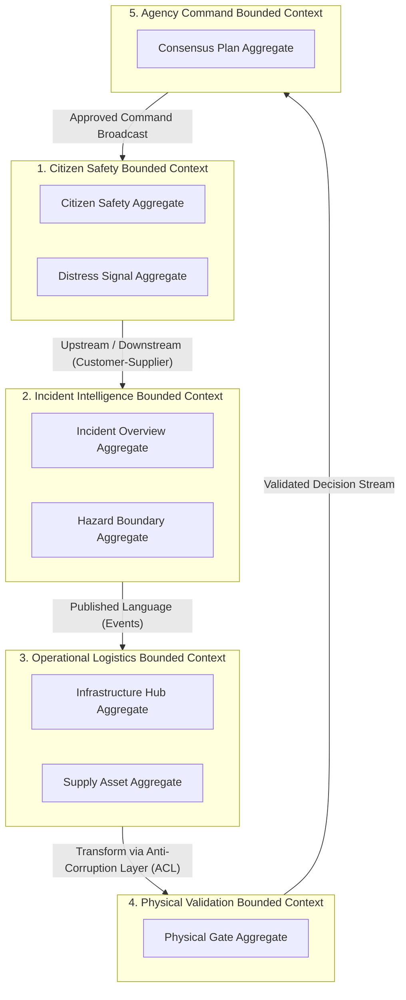
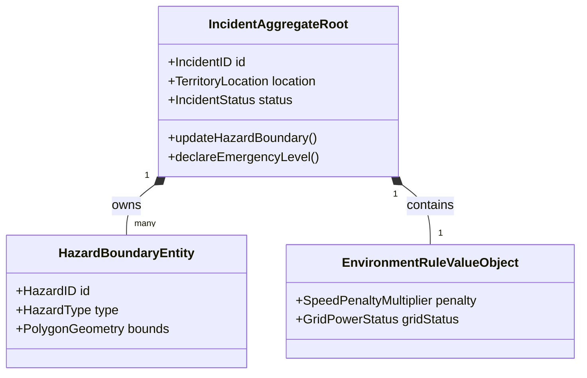
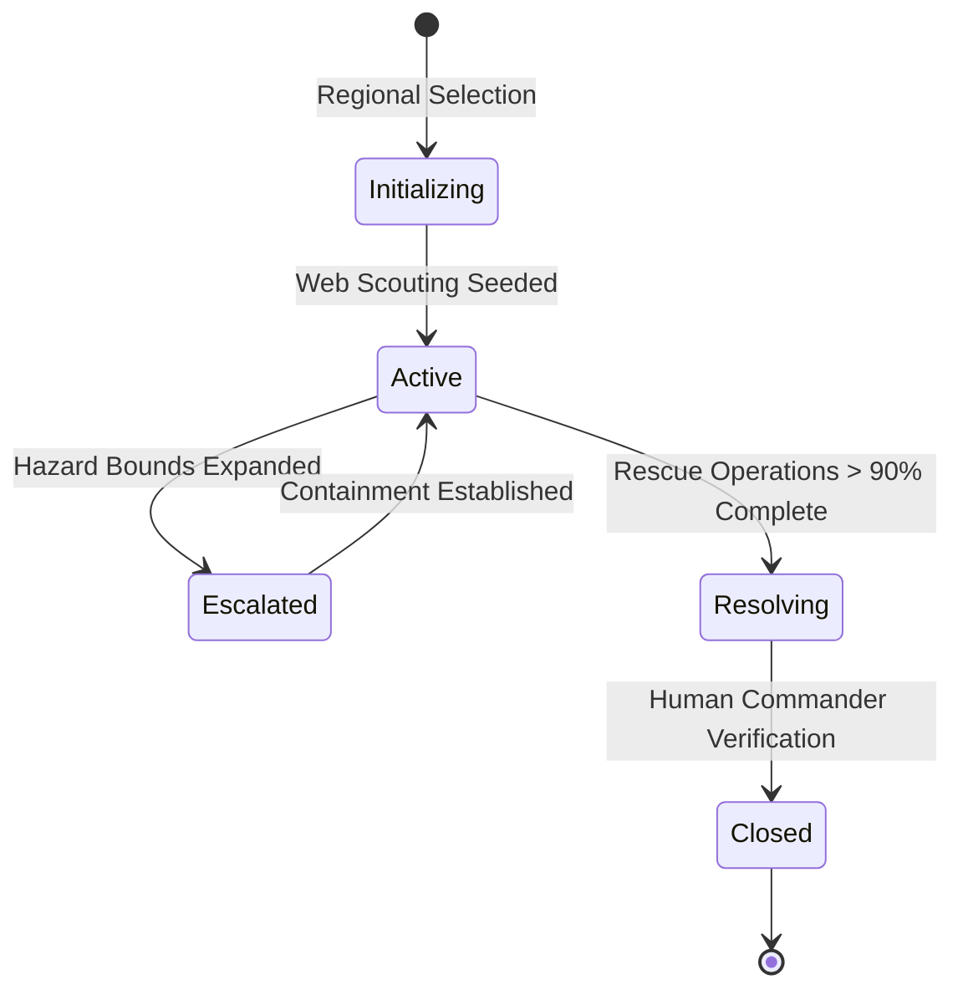
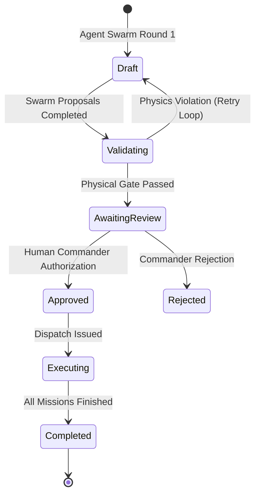
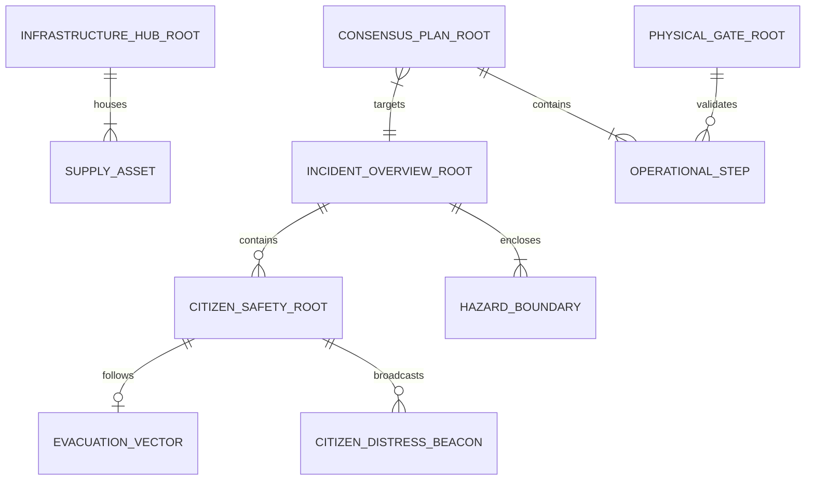

# MARG v2 — Phase 2: Canonical Domain Model Blueprint

## Document Metadata
- **Document Title**: CANONICAL_DOMAIN_MODEL.md (Phase 2 Domain Modeling Specification)
- **Project Name**: MARG v2 (Multi-Agent Routing and Guidance)
- **Role**: Chief Domain Architect, Principal Systems Architect & Domain-Driven Design (DDD) Lead
- **Status**: Phase 2 Domain Blueprint — Single Source of Ubiquitous Business Truth
- **Authoritative Baseline**: Derived strictly from [`docs/10_DISCOVERY/PHASE0.md`](../10_DISCOVERY/PHASE0.md) and [`docs/20_ARCHITECTURE/SYSTEM_ARCHITECTURE.md`](../20_ARCHITECTURE/SYSTEM_ARCHITECTURE.md)
- **Constraint Compliance**:
  - [x] Zero source code, database DDL statements, API endpoints, or ORM annotations
  - [x] Zero code generation outside `docs/30_DOMAIN/`
  - [x] Pure Domain-Driven Design (DDD) business language focus
  - [x] Strict Aggregate ownership and Context Map definitions
  - [x] All unresolved domain choices explicitly tagged as `PROVISIONAL`

---

# 1. Executive Summary

## 1.1 Purpose of the Canonical Domain Model
The **Canonical Domain Model** defines the single, authoritative business vocabulary and conceptual domain architecture of **MARG v2**. It establishes the business rules, invariants, bounded contexts, aggregates, entities, value objects, and domain events that govern emergency management workflows.

This document bridges the gap between raw human disaster reality and technical systems design. It represents the **business logic of survival and crisis response**—independent of software frameworks, programming languages, databases, or cloud infrastructure.

## 1.2 Relationship to Architecture & Implementation
```
┌─────────────────────────────────────────────────────────────────────────┐
│                    BUSINESS DOMAIN MODEL (Phase 2)                      │
│         Canonical Business Language, Rules, Aggregates & Invariants    │
└────────────────────────────────────┬────────────────────────────────────┘
                                     │ (Governs & Enforces Vocabulary)
                                     ▼
┌─────────────────────────────────────────────────────────────────────────┐
│                    SYSTEM ARCHITECTURE (Phase 1)                        │
│          C4 Containers, Runtime Modes & Subsystem Components            │
└────────────────────────────────────┬────────────────────────────────────┘
                                     │ (Implements Boundaries)
                                     ▼
┌─────────────────────────────────────────────────────────────────────────┐
│                   FUTURE IMPLEMENTATION (Phase 3+)                      │
│             Databases, API Contracts, UI Components & Code              │
└─────────────────────────────────────────────────────────────────────────┘
```

- **Architecture Boundary**: Architecture (Phase 1) specifies *where* and *how* containers run; the Domain Model (Phase 2) specifies *what business rules* those containers must enforce.
- **Implementation Constraint**: Downstream APIs, database schemas, AI agent system instructions, UI states, and data models MUST derive their terminology and state boundaries directly from this document. Nothing downstream may redefine concepts established here.

## 1.3 Importance of a Ubiquitous Language
During high-stress disasters, miscommunication leads to fatalities. If an NGO defines an "Evacuation Corridor" as a truck supply route, while a Police Traffic Chief defines it as a one-way civilian pedestrian path, logistics collapse.

The **Ubiquitous Language** established herein provides a single, unambiguous meaning for every business concept across software engineers, emergency response commanders, domain experts, and AI agent prompts.

---

# 2. Ubiquitous Language Dictionary

The dictionary below establishes the authoritative business terminology for MARG v2. Synonyms and colloquial terms are explicitly prohibited in downstream software artifacts.

| Business Term | Official Business Definition | Prohibited Synonyms / Misuses | Derived From |
| :--- | :--- | :--- | :--- |
| **Citizen** | An individual civilian present within a designated disaster impact zone requiring survival guidance, hazard awareness, or rescue. | "User", "Client", "Customer", "Victim" | CP-01, Persona-1 |
| **Incident** | An active, bounded real-world disaster event (e.g. urban flood, cyclone) occurring within a specific geographic territory. | "Ticket", "Case", "Task", "Simulation" | FR-01, FR-06 |
| **Distress Signal** | An emergency broadcast emitted by a Citizen declaring an immediate survival threat, location, and safety status. | "SOS Ping", "Help Ticket", "Alert Message" | CP-01, FR-02 |
| **Hazard Boundary** | A spatially geofenced polygon demarcating an active physical threat area (e.g. flooded basin, bridge collapse, fire zone). | "Danger Zone", "Red Box", "Restricted Region" | CP-06, FR-03, TD-MAP-01 |
| **Infrastructure Hub**| A fixed physical facility possessing emergency capacity or assets (e.g., Hospital, Cold Storage Depot, Relief Shelter). | "Node", "Point of Interest", "POI", "Station" | FR-07, TD-MAP-01 |
| **Evacuation Vector** | A physically validated, safe movement path assigned to a Citizen or group directing them away from Hazard Boundaries. | "Route", "Path", "Directions Line" | CP-01, CP-06, FR-02 |
| **Logistics Proposal**| A candidate resource or transport movement plan submitted by an emergency agency or AI worker for validation. | "Agent Bid", "Draft Offer", "Recommendation" | CP-06, FR-03, NFR-EXP-02 |
| **Consensus Plan** | A synthesized multi-agency operational plan that has passed symbolic physics validation and awaits human approval. | "Final Route", "Master Schedule", "AI Output" | CP-04, CP-05, FR-05 |
| **Physical Gate** | The non-AI symbolic verification rulebook that validates candidate proposals against real road polylines and payload caps. | "Physics Validator", "Checker", "Sanitizer" | CP-06, ADR-002, NFR-EXP-02 |
| **Commander** | An authorized human authority (e.g., EOC Lead, District Collector) possessing sole legal sign-off power over response plans. | "Admin", "Operator", "Manager", "User" | CP-05, FR-05, Persona-6 |

---

# 3. Domain Landscape (Bounded Contexts & Context Maps)

To avoid the anti-pattern of a "giant monolithic entity", MARG v2 separates the business domain into **five distinct Bounded Contexts**. No entity is shared globally across contexts; each context owns its specific representation of real-world concepts.



## 3.1 Bounded Context Breakdown

### 1. Citizen Safety Bounded Context
- **Business Purpose**: Dedicated exclusively to civilian survival, localized hazard avoidance, distress beaconing, and offline walking guidance.
- **Core Concern**: Safeguarding human life at the individual level (CP-01, CP-03).
- **Upstream / Downstream Relationships**: Downstream to Agency Command (receives approved evacuation signals); Upstream to Incident Intelligence (supplies distress beacons).

### 2. Incident Intelligence Bounded Context
- **Business Purpose**: Responsible for tracking real-world disaster geography, weather alert ingestion, and dynamic hazard polygon boundaries.
- **Core Concern**: Maintaining the authoritative spatial world model of the crisis territory.
- **Upstream / Downstream Relationships**: Supplies spatial hazard maps to Physical Validation and Operational Logistics.

### 3. Operational Logistics Bounded Context
- **Business Purpose**: Manages agency assets, hospital cold-chain supply counts, relief shelter capacities, and fleet vehicle availability.
- **Core Concern**: Balancing supply deficits against fleet logistics capacity across response agencies.
- **Upstream / Downstream Relationships**: Submits candidate Logistics Proposals to Physical Validation via an Anti-Corruption Layer (ACL).

### 4. Physical Validation Bounded Context
- **Business Purpose**: Enforces zero-AI deterministic physics rules, road polyline checks, vehicle payload caps, and spoilage ETA calculations.
- **Core Concern**: Absolute physical verification and hallucination prevention (CP-06).
- **Upstream / Downstream Relationships**: Receives raw proposals from Logistics; outputs verified decision tuples to Agency Command.

### 5. Agency Command Bounded Context
- **Business Purpose**: Synthesizes verified multi-agency operational steps into an executive Consensus Plan for Human Commander authorization.
- **Core Concern**: Command accountability, risk flag visibility, and human authorization control (CP-05).
- **Upstream / Downstream Relationships**: Receives verified tuples from Physical Validation; issues authorized execution signals to Citizen Safety.

---

# 4. Aggregate Design

An **Aggregate** is a cluster of domain objects (Entities and Value Objects) bound together by a single **Aggregate Root**. The Aggregate Root is the only gateway through which internal state modifications are permitted, enforcing business invariants across the entire cluster.



## 4.1 Aggregate Inventory Matrix

| Aggregate Root | Owning Bounded Context | Internal Entities / Value Objects | Business Consistency Boundary & Invariants Enforced |
| :--- | :--- | :--- | :--- |
| **Citizen Safety Root** | Citizen Safety Context | `CitizenDistressBeacon`, `EvacuationVector`, `SafetyStatus` | Ensures a Citizen cannot possess conflicting active evacuation vectors simultaneously. |
| **Incident Overview Root** | Incident Intelligence | `HazardBoundary`, `EnvironmentRule`, `TerritoryBounds` | Guarantees an Incident cannot be closed while active un-rescued Distress Signals remain in its territory. |
| **Infrastructure Hub Root** | Operational Logistics | `SupplyAsset`, `StorageCapacity`, `FacilityStatus` | Enforces that reserved asset allocations never exceed total physical storage capacity. |
| **Physical Gate Root** | Physical Validation | `CandidateProposal`, `ValidatedStep`, `RuleViolation` | Enforces that no proposal is marked `Validated` if travel ETA exceeds supply spoilage time. |
| **Consensus Plan Root** | Agency Command | `OperationalStep`, `RiskFlag`, `ApprovalState` | Guarantees a Consensus Plan cannot transition to `Approved` without explicit Commander sign-off. |

---

# 5. Core Domain Entities

```
                         ENTITY TAXONOMY & OWNERSHIP
                         
┌─────────────────────────────────────────────────────────────────────────┐
│ CITIZEN SAFETY CONTEXT                                                  │
│  - Citizen Safety Profile [Entity] (Owning Root: Citizen Safety Root)   │
│  - Citizen Distress Beacon [Entity] (Owning Root: Citizen Safety Root)  │
└─────────────────────────────────────────────────────────────────────────┘
┌─────────────────────────────────────────────────────────────────────────┐
│ INCIDENT INTELLIGENCE CONTEXT                                           │
│  - Hazard Boundary [Entity] (Owning Root: Incident Overview Root)       │
└─────────────────────────────────────────────────────────────────────────┘
┌─────────────────────────────────────────────────────────────────────────┐
│ OPERATIONAL LOGISTICS CONTEXT                                           │
│  - Infrastructure Hub [Entity] (Owning Root: Infrastructure Hub Root)   │
│  - Supply Asset [Entity] (Owning Root: Infrastructure Hub Root)         │
└─────────────────────────────────────────────────────────────────────────┘
┌─────────────────────────────────────────────────────────────────────────┐
│ AGENCY COMMAND CONTEXT                                                  │
│  - Consensus Plan [Entity] (Owning Root: Consensus Plan Root)           │
└─────────────────────────────────────────────────────────────────────────┘
```

## 5.1 Entity Specifications

### 1. Citizen Safety Profile
- **Description**: Represents a civilian's local emergency profile and safety status within an active disaster zone.
- **Owning Bounded Context**: Citizen Safety Bounded Context.
- **Owning Aggregate Root**: Citizen Safety Root.
- **Responsibilities**: Maintains individual location observations, mobility capability, and active evacuation vectors.
- **Business Invariants**: Must always maintain exactly one active `SafetyStatus` (`Safe`, `Evacuating`, `Distressed`, `Rescued`).
- **Lifecycle**: Created upon client initialization $\rightarrow$ Updates during movement/evacuation $\rightarrow$ Archived upon reach of safe shelter.
- **Mutation Authority**: Citizen Safety Root only.
- **Derived From**: CP-01, Persona-1, FR-02.

### 2. Citizen Distress Beacon
- **Description**: An active survival signal emitted by a Citizen declaring urgent danger.
- **Owning Bounded Context**: Citizen Safety Bounded Context.
- **Owning Aggregate Root**: Citizen Safety Root.
- **Responsibilities**: Holds emergency medical needs, water level observations, and family headcounts.
- **Business Invariants**: Cannot be deleted or marked `Resolved` without formal Search & Rescue squad confirmation.
- **Lifecycle**: Broadcasted $\rightarrow$ Triaged $\rightarrow$ Assigned to S&R $\rightarrow$ Resolved.
- **Mutation Authority**: Citizen Safety Root.
- **Derived From**: CP-01, FR-02, Persona-7.

### 3. Hazard Boundary
- **Description**: A geofenced physical polygon demarcating an active threat (e.g. flooded river, fire, collapsed bridge).
- **Owning Bounded Context**: Incident Intelligence Bounded Context.
- **Owning Aggregate Root**: Incident Overview Root.
- **Responsibilities**: Defines spatial exclusion zones and speed reduction multipliers for routing engines.
- **Business Invariants**: Must consist of a valid non-self-intersecting polygon with at least 3 vertices.
- **Lifecycle**: Discovered via Scouting $\rightarrow$ Expanded/Contracted via Reports $\rightarrow$ Dissolved post-disaster.
- **Mutation Authority**: Incident Overview Root.
- **Derived From**: CP-06, FR-03, FR-07, TD-MAP-01.

### 4. Infrastructure Hub
- **Description**: A physical facility possessing emergency capacities or relief inventory (e.g., Hospital, Supply Depot).
- **Owning Bounded Context**: Operational Logistics Bounded Context.
- **Owning Aggregate Root**: Infrastructure Hub Root.
- **Responsibilities**: Tracks facility operational state, power grid status, and available asset stocks.
- **Business Invariants**: Total allocated supplies across active missions must never exceed `StorageCapacity`.
- **Lifecycle**: Seeded via Research Scouting $\rightarrow$ State updated during logistics rounds $\rightarrow$ Decommissioned.
- **Mutation Authority**: Infrastructure Hub Root.
- **Derived From**: FR-07, TD-MAP-01, Persona-2.

### 5. Supply Asset
- **Description**: Specific emergency equipment or relief inventory (e.g. reefer trucks, medical drones, dry ice packs).
- **Owning Bounded Context**: Operational Logistics Bounded Context.
- **Owning Aggregate Root**: Infrastructure Hub Root.
- **Responsibilities**: Tracks vehicle payload limits, speed capability, and operational availability.
- **Business Invariants**: Drone payload quantity allocation must never exceed 100 units per wave.
- **Lifecycle**: Registered at Hub $\rightarrow$ Dispatched on Mission $\rightarrow$ Returned to Depot.
- **Mutation Authority**: Infrastructure Hub Root.
- **Derived From**: FR-03, NFR-EXP-02, Persona-3.

### 6. Consensus Plan
- **Description**: Synthesized multi-agency operational plan awaiting human authorization.
- **Owning Bounded Context**: Agency Command Bounded Context.
- **Owning Aggregate Root**: Consensus Plan Root.
- **Responsibilities**: Holds verified operational transport steps, executive narrative summary, and risk flags.
- **Business Invariants**: Cannot transition to `Approved` state without explicit human Commander authorization.
- **Lifecycle**: Synthesized $\rightarrow$ Awaiting Review $\rightarrow$ Approved (or Rejected/Modified) $\rightarrow$ Executed.
- **Mutation Authority**: Consensus Plan Root.
- **Derived From**: CP-05, FR-05, ADR-004.

---

# 6. Immutable Value Objects

Value Objects possess no conceptual identity; they are defined entirely by their attributes and are strictly **immutable**.

```
                         VALUE OBJECT PROFILES
                         
┌───────────────────────────┐     ┌───────────────────────────┐     ┌───────────────────────────┐
│     GPS COORDINATE        │     │       RISK SCORE          │     │     PHYSICAL CONSTRAINT   │
│ Attributes:               │     │ Attributes:               │     │ Attributes:               │
│ - Latitude, Longitude     │     │ - Score (0.0 to 1.0)      │     │ - Max Payload Units (100) │
│ - Observation Timestamp   │     │ - Severity Level (Enum)   │     │ - Max Speed (15 km/h)     │
│ - Observed Source         │     │ - Confidence Rating       │     │ - Power Grid Requirement  │
│ - Temporal Validity (10m) │     │ - Temporal Expiry         │     │ - Observed Source         │
└───────────────────────────┘     └───────────────────────────┘     └───────────────────────────┘
```

## 6.1 Value Object Specifications

### 1. Geographic Coordinate (`GPSCoordinate`)
- **Description**: Immutably defines a spatial location on Earth.
- **Attributes**: `Latitude` (float), `Longitude` (float), `ObservationTimestamp` (timestamp), `ObservationSource` (string), `Confidence` (float), `TemporalValidity` (duration).
- **Immutability Rationale**: Spatial location at a specific moment in time is an immutable historical observation.

### 2. Risk Score (`RiskScore`)
- **Description**: Quantifies the calculated danger level for a citizen or logistics route.
- **Attributes**: `ScoreValue` (0.0 to 1.0), `SeverityCategory` (`Low`, `Medium`, `High`, `Critical`), `ObservationTimestamp` (timestamp), `Confidence` (float).
- **Immutability Rationale**: Risk evaluations are point-in-time mathematical calculations; changes produce a new score object.

### 3. Physical Constraint (`PhysicalConstraint`)
- **Description**: Defines immutable physical limits governing vehicles and infrastructure.
- **Attributes**: `MaxPayloadUnits` (integer), `MaxSpeedKmh` (float), `RequiresGridPower` (boolean), `ObservationSource` (string).
- **Immutability Rationale**: Physical laws and equipment capacities do not dynamically mutate during operation.

---

# 7. Domain Events

Domain Events represent significant business occurrences within the domain. They are named in the past tense to reflect established historical facts.

```
                      DOMAIN EVENT TIMELINE FLOW
                      
   [ IncidentDeclared ] ──► [ HazardBoundariesUpdated ] ──► [ DistressSignalBroadcast ]
                                                                     │
                                                                     ▼
   [ PlanApproved ] <── [ PhysicalValidationPassed ] <── [ LogisticsProposalSubmitted ]
```

## 7.1 Domain Event Definitions

### 1. `IncidentDeclared`
- **Business Meaning**: A new regional disaster has been recognized by authorities or system seeding.
- **Trigger**: Submission of regional crisis initialization request.
- **Producer**: Incident Intelligence Bounded Context (`Incident Overview Root`).
- **Consumers**: Citizen Safety Context, Operational Logistics Context.
- **Idempotency & Ordering**: Idempotent by `IncidentID`; MUST precede all routing operations.

### 2. `DistressSignalBroadcast`
- **Business Meaning**: A Citizen has transmitted an emergency call for help.
- **Trigger**: Citizen tapping emergency SOS button on client.
- **Producer**: Citizen Safety Bounded Context (`Citizen Safety Root`).
- **Consumers**: Agency Command Context, Search & Rescue Squads.
- **Idempotency & Ordering**: Idempotent by `BeaconID`; ordered by `ObservationTimestamp`.

### 3. `HazardBoundariesUpdated`
- **Business Meaning**: A new flooded basin, fire zone, or bridge collapse has been mapped.
- **Trigger**: Research Agent scouting detection or field officer hazard submission.
- **Producer**: Incident Intelligence Bounded Context (`Incident Overview Root`).
- **Consumers**: Physical Validation Context, Citizen Safety Context (triggers route recalculation).
- **Business Consequences**: Instantly invalidates any candidate routes intersecting the new polygon.

### 4. `LogisticsProposalSubmitted`
- **Business Meaning**: An agency or AI worker has proposed a supply or vehicle movement step.
- **Trigger**: Agent execution round output generation.
- **Producer**: Operational Logistics Bounded Context (`Infrastructure Hub Root`).
- **Consumers**: Physical Validation Bounded Context.
- **Idempotency & Ordering**: Evaluated sequentially per round.

### 5. `PhysicalValidationPassed`
- **Business Meaning**: A candidate logistics step has passed all deterministic physics gate checks.
- **Trigger**: Successful verification against road polylines, vehicle capacities, and spoilage ETAs.
- **Producer**: Physical Validation Bounded Context (`Physical Gate Root`).
- **Consumers**: Agency Command Context (appends step to candidate Consensus Plan).

### 6. `PhysicalValidationFailed`
- **Business Meaning**: A candidate proposal violated a deterministic physical law.
- **Trigger**: Gate detection of speed violations, grid failure conflicts, or payload caps.
- **Producer**: Physical Validation Bounded Context (`Physical Gate Root`).
- **Consumers**: Operational Logistics Context (triggers agent turn retry with error context).

### 7. `ConsensusPlanApproved`
- **Business Meaning**: A human Commander has formally authorized an operational response plan.
- **Trigger**: Commander clicking "Review & Approve Plan" on tactical dashboard.
- **Producer**: Agency Command Bounded Context (`Consensus Plan Root`).
- **Consumers**: Citizen Safety Context, Response Fleet Dispatch.
- **Business Consequences**: Authorizes physical vehicle movement and broadcasts green evacuation corridors.

---

# 8. Business Rules Engine

The following pure business rules govern domain operation across all contexts.

- **BR-01 (Citizen Safety Priority)**: In any computational or resource conflict between civilian evacuation and agency asset retrieval, the domain MUST prioritize civilian life (CP-01, CP-02).
- **BR-02 (Zero Unvalidated Routing)**: No path, vector, or route shall be displayed to a Citizen or Commander unless it has received a `PhysicalValidationPassed` event (CP-06, FR-03).
- **BR-03 (Drone Payload Cap)**: Aerial drone supply waves are strictly constrained to a maximum of 100 units per wave (FR-03, NFR-EXP-02).
- **BR-04 (Grid Power Dependency)**: Refrigerated solar storage units cannot be dispatched or operated when `GridPowerStatus` is marked `Offline` (FR-03).
- **BR-05 (Context Window Slicing)**: Neural agent prompt context assembly MUST deterministically slice only the most recent 6 messages from shared history to eliminate context bloat (CP-11, ADR-007).
- **BR-06 (Human Commander Authorization)**: Final execution of a Consensus Plan requires a explicit `ConsensusPlanApproved` event generated by a human Commander actor (CP-05, FR-05).

---

# 9. Business State Machines

State transitions are modeled exclusively for entities possessing genuine business lifecycles.

## 9.1 Incident Lifecycle State Machine



## 9.2 Consensus Plan State Machine



---

# 10. Entity Relationship Diagram (Conceptual Domain View)

This diagram models conceptual domain relationships between Aggregate Roots and Entities. It is **NOT a database ERD**.



---

# 11. Domain Invariants

Domain Invariants are universal business assertions that must remain true at all times under all circumstances.

1. **INVARIANT-01**: An `Incident` cannot transition to `Closed` while active `DistressSignals` marked `Unresolved` remain within its geographic bounds.
2. **INVARIANT-02**: An `EvacuationVector` presented to a `Citizen` must never intersect an active `HazardBoundary` polygon.
3. **INVARIANT-03**: A `ConsensusPlan` cannot contain an `OperationalStep` that has been flagged as `Rejected` by the `PhysicalGateRoot`.
4. **INVARIANT-04**: The allocated quantity of a `SupplyAsset` across all active plans must never exceed the `StorageCapacity` of its owning `InfrastructureHub`.

---

# 12. System Actors vs. Domain Concepts

To maintain clear boundary separation, system elements are categorized into distinct conceptual roles:

| Element Name | Categorization | Architectural Context | Domain State & Authority |
| :--- | :--- | :--- | :--- |
| **Citizen** | Human Business Actor | Primary User | Emits distress signals; owns local safety state. |
| **Commander** | Human Business Actor | Secondary User | Legal authority; owns plan approval decisions. |
| **Hospital Agent** | AI Domain Worker | Cognitive Engine | Proposes cold-chain medical supply requests. |
| **Transport Agent** | AI Domain Worker | Cognitive Engine | Proposes vehicle fleet routes and load steps. |
| **Swarm Director** | AI Domain Supervisor| Cognitive Engine | Synthesizes multi-agent consensus summaries. |
| **Physical Gate** | Symbolic Domain Rulebook| Validation Engine | Authoritative enforcer of physical invariants. |
| **Firebase RTDB** | Infrastructure Component| Persistence Layer | Zero domain authority; ephemeral sync transport. |
| **MapLibre GL** | Infrastructure Component| Client Surface | Zero domain authority; visual map rendering engine. |

---

# 13. Domain Risk Management

| Risk ID | Domain Risk Description | Likelihood | Impact | Domain Mitigation Strategy |
| :--- | :--- | :--- | :--- | :--- |
| **D-RISK-01**| Terminology ambiguity between emergency agencies (e.g. "Evacuation Route" vs "Supply Corridor"). | High | High | Enforce strict compliance with Section 2 Ubiquitous Language across UI and AI prompt system instructions. |
| **D-RISK-02**| Boundary collision between Citizen Safety Context and Agency Command Context. | Medium | Critical | Implement an Anti-Corruption Layer (ACL) translating top-down supply steps into citizen-safe evacuation vectors. |
| **D-RISK-03**| Event out-of-order delivery during peer-to-peer offline mesh sync. | High | Medium | Apply CRDT state models with monotonically increasing logical timestamps (`ObservationTimestamp`). |

---

# 14. Domain Open Decisions (Carried Forward)

In accordance with Phase 0 and Phase 1 rules, unresolved domain choices are carried forward with `PROVISIONAL` status. **No decision is resolved without empirical evidence.**

## 14.1 Open Decision 1: Formal Adoption of Common Alerting Protocol (CAP) Standard (`STATUS: PROVISIONAL`)
- **Why Unresolved**: Requires assessing whether wrapping `IncidentDeclared` and `HazardBoundariesUpdated` events in OASIS CAP XML/JSON format adds compliance value for Indian State EOCs without overcomplicating MVP payloads.
- **Information Required**: Formal feedback from NDMA/SDMA technical integration leads.
- **Target Resolution Phase**: Phase 3 (Data Schema & API Specification).
- **Phase 0 Reference**: External Domain Standards Section.

## 14.2 Open Decision 2: Distress Signal Prioritization Matrix (`STATUS: PROVISIONAL`)
- **Why Unresolved**: Tradeoff between medical vulnerability scoring vs water rise velocity vs family group clustering.
- **Information Required**: Field trial inputs from Search & Rescue (NDRF) battalion commanders.
- **Target Resolution Phase**: Phase 3 (Data Schema & API Specification).
- **Phase 0 Reference**: Open Question Q4.

---

# 15. Future Domain Evolution (Out of Scope for MARG v2)

The following business concepts represent long-term domain expansions and are explicitly **OUT OF SCOPE FOR MARG V2**:

- **OUT-OF-SCOPE-DOM-01**: **Livestock & Agricultural Relief Context**: Business entities managing farm animal evacuation and veterinary logistics.
- **OUT-OF-SCOPE-DOM-02**: **International Border Evacuation Protocol**: Cross-border diplomatic clearance entities for refugee transit.
- **OUT-OF-SCOPE-DOM-03**: **Insurance Claims Audit Domain**: Automated post-disaster property loss financial verification entities.

---

# 16. Domain Review Summary & Phase 3 Readiness

## 16.1 Domain Strengths
1. **Rigorously Citizen-Centric**: Establishes civilian survival as the primary business concern of the entire system (CP-01).
2. **Strict Boundary Isolation**: 5 distinct Bounded Contexts prevent entity pollution and eliminate the "monolithic shared object" anti-pattern.
3. **Absolute Ubiquitous Language**: Standardizes terminology across human commanders, developers, and AI prompt contexts.

## 16.2 Readiness for Phase 3 (Data Schemas & API Specifications)
The Canonical Domain Model for MARG v2 is **FULLY APPROVED AND READY FOR PHASE 3**. All business entities, aggregates, bounded contexts, value objects, domain events, and state machines are established with 100% traceability to Phase 0 Discovery and Phase 1 Architecture.

---
*End of Canonical Domain Model Blueprint (`docs/30_DOMAIN/CANONICAL_DOMAIN_MODEL.md`).*
