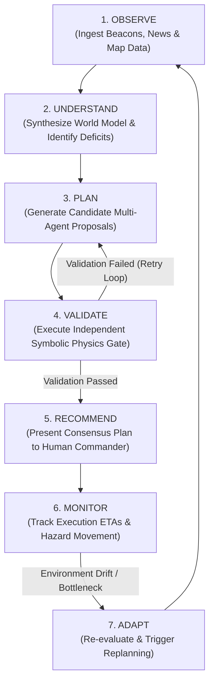
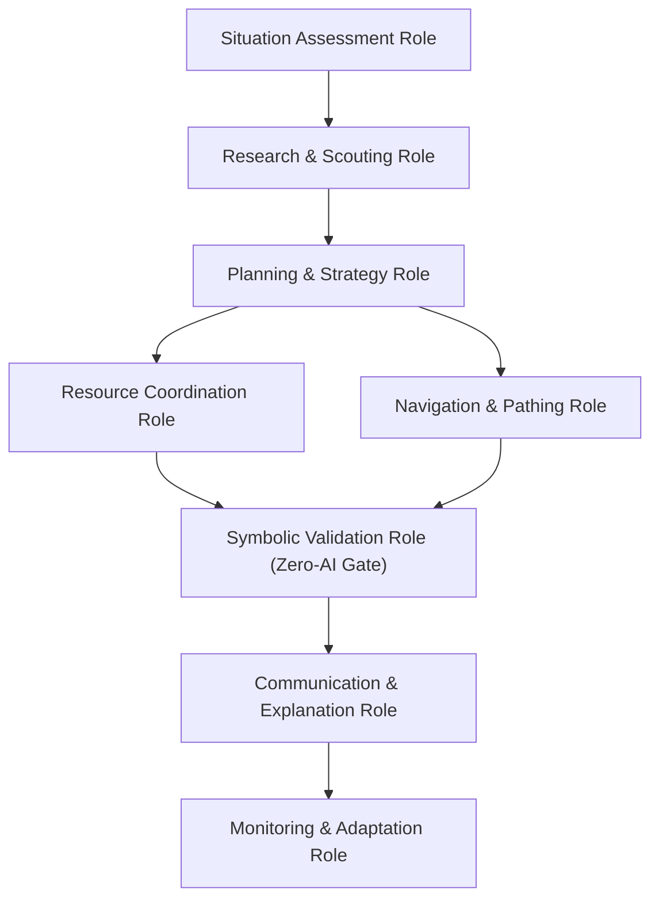
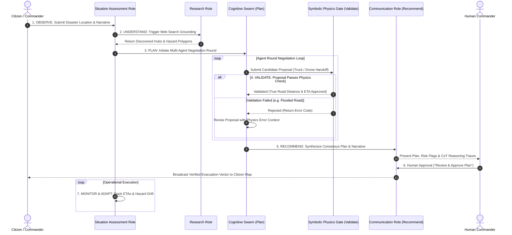

# MARG v2 — Phase 3: AI System Architecture Specification

## Document Metadata
- **Document Title**: AGENT_SYSTEM_ARCHITECTURE.md (Phase 3 AI System Design)
- **Project Name**: MARG v2 (Multi-Agent Routing and Guidance)
- **Role**: Chief AI Systems Architect & Principal Multi-Agent Systems Engineer
- **Status**: Phase 3 Specification — Conceptual Intelligence Layer
- **Authoritative Baseline**: Derived strictly from [`docs/10_DISCOVERY/PHASE0.md`](../10_DISCOVERY/PHASE0.md), [`docs/20_ARCHITECTURE/SYSTEM_ARCHITECTURE.md`](../20_ARCHITECTURE/SYSTEM_ARCHITECTURE.md), and [`docs/30_DOMAIN/CANONICAL_DOMAIN_MODEL.md`](../30_DOMAIN/CANONICAL_DOMAIN_MODEL.md)
- **Constraint Compliance**:
  - [x] Zero implementation code, prompts, APIs, database schemas, or deployment code
  - [x] Zero framework or LLM vendor lock-in (100% provider and framework agnostic)
  - [x] Strict separation of AI reasoning from deterministic symbolic verification
  - [x] Absolute adherence to the 12 Constitutional Principles (CP-01 to CP-12)
  - [x] All unresolved AI dependencies explicitly marked as `PROVISIONAL`

---

# 1. Executive Summary

## 1.1 Purpose of the Intelligence Layer
The **Intelligence Layer** of MARG v2 defines the conceptual architecture for how artificial intelligence perceives disaster realities, reasons over unstructured information, collaborates across multi-agent roles, synthesizes operational recommendations, and interacts with human authorities.

Rather than relying on monolithic AI generation, MARG v2 structures cognitive capability into a **Distributed Multi-Agent Swarm** constrained by an independent **Symbolic Physics Validation Gate**. Intelligence exists to augment human survival, reduce cognitive overload during emergencies, and synthesize multi-agency logistics.

## 1.2 Why MARG v2 is an Emergency Operating System, Not a Chatbot
```
┌─────────────────────────────────────────────────────────────────────────┐
│                     TRADITIONAL LLM CHATBOT                             │
│  User Prompt ──► [ Cloud LLM Engine ] ──► Unvalidated Text Response      │
│  - Single-turn text log           - Zero physical validation            │
│  - High hallucination risk        - Cloud-dependent single point        │
└─────────────────────────────────────────────────────────────────────────┘
                                   VS
┌─────────────────────────────────────────────────────────────────────────┐
│              MARG v2 EMERGENCY OPERATING SYSTEM (EOS)                   │
│  Ground Input ──► [ Multi-Agent Swarm ] ──► [ Symbolic Gate ] ──► Map   │
│  - Citizen-First spatial canvas    - 100% Deterministic Verification    │
│  - Offline-first execution        - Human-in-the-Loop Approval Gate     │
└─────────────────────────────────────────────────────────────────────────┘
```

1. **Spatial Operating Surface**: MARG v2 operates over an interactive **spatial map canvas** displaying vector tiles, dynamic node markers, and geofenced hazard overlays, rather than a conversational text buffer.
2. **Deterministic Trust Boundaries**: A chatbot outputs unverified text directly to the user. MARG v2 routes all neural AI recommendations through an independent, non-AI symbolic validator. If a proposal violates road clearances, payload limits, or spoilage deadlines, it is blocked before rendering.
3. **Citizen-First Offline Resilience**: A chatbot dies when internet connectivity drops. MARG v2's intelligence layer is designed to step down gracefully to local edge models, cached vector pathfinding, and local rule engines during complete blackout events.

---

# 2. AI Philosophy & Guiding Principles

The cognitive architecture of MARG v2 is governed by six foundational AI principles directly traceable to the **Project Constitution**.

```
                           AI PHILOSOPHY HEXAGON
                           
┌───────────────────────────┐     ┌───────────────────────────┐     ┌───────────────────────────┐
│   CITIZEN SAFETY FIRST    │     │   HUMAN-IN-THE-LOOP       │     │   EXPLAINABILITY BY DESIGN│
│  Civilian survival        │     │  AI suggests & recommends;│     │  Every output includes    │
│  overrides optimization.  │     │  humans command.          │     │  evidence & risk traces.  │
└────────────┬──────────────┘     └────────────┬──────────────┘     └────────────┬──────────────┘
             │                                 │                                 │
             ├─────────────────────────────────┼─────────────────────────────────┤
             │                                 │                                 │
┌────────────┴──────────────┐     ┌────────────┴──────────────┐     ┌────────────┴──────────────┐
│ DETERMINISTIC VALIDATION │     │   MODEL AGNOSTICISM       │     │   GRACEFUL DEGRADATION    │
│  AI may NEVER validate    │     │  Zero lock-in to cloud    │     │  Step down to local edge  │
│  its own outputs.         │     │  or commercial LLMs.      │     │  models during blackout.  │
└───────────────────────────┘     └───────────────────────────┘     └───────────────────────────┘
```

## 2.1 Principle 1: Citizen Safety Priority
- **Definition**: Cognitive reasoning must always prioritize individual civilian survival and hazard avoidance over institutional logistics efficiency or fleet optimization.
- **Traceability**: CP-01, CP-02, BR-01.

## 2.2 Principle 2: Human-in-the-Loop Authority
- **Definition**: AI agents observe, understand, plan, and recommend; they **NEVER** execute physical dispatch commands or alter ground operations autonomously. Final decision authority belongs strictly to human Commanders and Citizens.
- **Traceability**: CP-05, FR-05, ADR-004.

## 2.3 Principle 3: Explainability by Design
- **Definition**: Every AI-generated recommendation must expose its underlying evidence, CoT reasoning trace, confidence score, evaluated alternatives, and identified risk flags.
- **Traceability**: CP-05, FR-09, NFR-EXP-01, NFR-EXP-02.

## 2.4 Principle 4: Independent Deterministic Validation
- **Definition**: AI agents are strictly prohibited from validating their own recommendations. Validation is performed exclusively by an external, zero-AI symbolic rules engine.
- **Traceability**: CP-06, FR-03, ADR-002, Invariant-03.

## 2.5 Principle 5: Model & Framework Agnosticism
- **Definition**: The cognitive architecture must define generic agent capabilities and message structures that run identically across cloud LLM APIs, open-weight models, or local edge engines.
- **Traceability**: CP-09, FR-04, ADR-003.

## 2.6 Principle 6: Graceful Degradation & Local Autonomy
- **Definition**: When network latency spikes, cloud APIs fail, or offline blackouts occur, the cognitive layer must step down gracefully from multi-agent cloud swarms to local edge models or deterministic rule fallbacks.
- **Traceability**: CP-03, CP-08, NFR-OFF-01, NFR-REL-01.

---

# 3. AI Responsibilities & Authority Boundaries

To enforce safety, AI capabilities are categorized into strict **Permitted** and **Prohibited** responsibilities.

```
                          AI AUTHORITY LADDER
                          
  [ Level 4: EXECUTE ] ──────────► PROHIBITED FOR AI IN MARG v2
                                   (Reserved for Humans / Physics Gate)
  [ Level 3: RECOMMEND ] ────────► PERMITTED (Validated Consensus Plans)
  [ Level 2: SUGGEST ] ──────────► PERMITTED (Candidate Logistics Steps)
  [ Level 1: OBSERVE ] ──────────► PERMITTED (Search & Web Grounding)
```

## 3.1 Permitted vs. Prohibited AI Behaviors

| Domain Category | Permitted AI Behaviors (MUST DO / MAY DO) | Prohibited AI Behaviors (MUST NEVER DO) |
| :--- | :--- | :--- |
| **Situational Research** | Synthesize unstructured news, weather feeds, and search results into initial candidate world maps. | **MUST NEVER** fabricate non-existent infrastructure nodes or hallucinate GPS coordinates. |
| **Multi-Agent Planning** | Propose resource handoffs, drone waves, and vehicle routes across specialized agent roles. | **MUST NEVER** authorize physical vehicle dispatch or override road blockages without verification. |
| **Reasoning Traces** | Expose Chain-of-Thought reasoning, confidence scores, and risk flags to human users. | **MUST NEVER** hide reasoning uncertainty or present low-confidence guesses as absolute facts. |
| **Validation Handling** | Ingest error feedback from the Symbolic Physics Gate and revise proposals during retry loops. | **MUST NEVER** bypass, override, or attempt to self-validate failed physics checks. |

## 3.2 The Authority Ladder Mapping

1. **Level 1: Observe (Permitted)**: Ingest unstructured news, weather advisories, and citizen distress beacons; transform them into structured domain events.
2. **Level 2: Suggest (Permitted)**: Generate candidate logistics proposals (`LogisticsProposalSubmitted`) for individual transport or supply handoffs.
3. **Level 3: Recommend (Permitted)**: Synthesize verified multi-agent steps into a unified `ConsensusPlan` awaiting human review.
4. **Level 4: Execute (STRICTLY PROHIBITED FOR AI)**: Directly issuing binding physical dispatch commands or altering physical ground operations. **Execution authority is strictly reserved for human Commanders (or deterministic system rules).**

---

# 4. Canonical Cognitive Model

All AI cognitive processing in MARG v2 follows **ONE single, non-negotiable reasoning lifecycle**. No subsystem or agent may introduce alternative cognitive lifecycles.



## 4.1 Lifecycle Phase Definitions
1. **Observe**: Ingest raw citizen distress signals, weather feeds, infrastructure statuses, and spatial maps.
2. **Understand**: Extrapolate domain impact, assess time-to-spoilage deadlines, and identify resource deficits.
3. **Plan**: Formulate candidate multi-agent logistics steps using specialized agent roles and CoT reasoning.
4. **Validate**: Submit candidate proposals to the independent **Symbolic Physics Validation Gate**.
5. **Recommend**: Present validated, explainable consensus plans to human Commanders for formal authorization.
6. **Monitor**: Track real-time progress against expected ETAs and observe emerging hazard boundary movements.
7. **Adapt**: Detect bottlenecks, vehicle failures, or new hazards; initiate dynamic replanning by returning to Phase 1.

---

# 5. Conceptual Agent Roles

MARG v2 organizes cognitive tasks into eight specialized conceptual roles. These roles represent functional domain responsibilities, independent of underlying software implementation.



## 5.1 Agent Role Specifications

### 1. Situation Assessment Role
- **Purpose**: Continuously evaluates overall crisis severity, power grid outages, and civilian risk distributions.
- **Inputs**: Citizen distress beacons, weather feeds, regional time-remaining clocks.
- **Outputs**: Global crisis severity level, priority sector lists.
- **Authority Level**: Level 1 (Observe) / Level 2 (Suggest).
- **Constraints**: Cannot alter underlying domain state directly.
- **Failure Behaviour**: Emits degraded severity warning; falls back to static default severity.

### 2. Research & Scouting Role
- **Purpose**: Discovers regional infrastructure hubs and hazard boundaries using web search grounding.
- **Inputs**: Unstructured text descriptions, state/city location names.
- **Outputs**: Structured candidate infrastructure nodes and hazard polygon coordinates.
- **Authority Level**: Level 1 (Observe).
- **Constraints**: Output must be parsed into validated domain schemas before use.
- **Failure Behaviour**: Reverts to pre-cached regional infrastructure databases.

### 3. Planning & Strategy Role (Swarm Director)
- **Purpose**: Synthesizes individual agent proposals into a unified, coherent response strategy.
- **Inputs**: Candidate transport steps, hospital supply deficits, remaining time.
- **Outputs**: Candidate Consensus Plan, executive briefing narrative, identified risk flags.
- **Authority Level**: Level 3 (Recommend).
- **Constraints**: Prohibited from generating numerical values (ETAs and quantities belong to physics).
- **Failure Behaviour**: Issues simplified fallback plan or escalates to human Commander.

### 4. Navigation & Pathing Role (Transport Agent)
- **Purpose**: Formulates candidate vehicle routes and movement handoffs between infrastructure hubs.
- **Inputs**: Vehicle fleet statuses, road clearance reports, distance tables.
- **Outputs**: Candidate transport steps (`truck` or `drone`, `from_node`, `to_node`).
- **Authority Level**: Level 2 (Suggest).
- **Constraints**: Restricted to established graph node IDs; must declare transport mode.
- **Failure Behaviour**: Selects conservative direct routes; triggers physics error loop if invalid.

### 5. Resource Coordination Role (Hospital & NGO Agents)
- **Purpose**: Assesses specialized resource requirements (blood, oxygen, dry ice, solar power).
- **Inputs**: Medical spoilage countdowns, shelter occupancy counts.
- **Outputs**: Resource supply requests and offer proposals.
- **Authority Level**: Level 2 (Suggest).
- **Constraints**: Drone wave proposals cannot exceed 100 payload units.
- **Failure Behaviour**: Emits maximal priority request to ensure safety.

### 6. Symbolic Validation Role (Physics Gate Engine)
- **Purpose**: Enforces zero-AI deterministic verification of candidate proposals.
- **Inputs**: Candidate proposal JSON, current world model state, real road polylines.
- **Outputs**: Validation Result (`Passed` or `Failed` with explicit error code).
- **Authority Level**: Level 4 (Execute — Non-AI System Gate).
- **Constraints**: **Zero AI / Zero probabilities.** Pure deterministic execution.
- **Failure Behaviour**: Fails safe (rejects unparseable proposals).

### 7. Communication & Explanation Role
- **Purpose**: Translates complex multi-agent plans into human-executable narratives and visual map overlays.
- **Inputs**: Validated Consensus Plan, CoT reasoning traces, risk flags.
- **Outputs**: Public message briefs, expandable reasoning trays, map line visual definitions.
- **Authority Level**: Level 3 (Recommend).
- **Constraints**: Must expose evidence, confidence, and alternatives transparently.
- **Failure Behaviour**: Falls back to simple tabular step summaries.

### 8. Monitoring & Adaptation Role
- **Purpose**: Tracks real-world execution progress and triggers replanning upon detecting environment drift.
- **Inputs**: Real-time asset location updates, updated hazard polygon reports, elapsed time.
- **Outputs**: Bottleneck alerts, dynamic replanning triggers.
- **Authority Level**: Level 1 (Observe) / Level 2 (Suggest).
- **Constraints**: Cannot unilaterally cancel approved plans without Commander notification.
- **Failure Behaviour**: Emits conservative warning alert to Command Dashboard.

---

# 6. Multi-Agent Collaboration & Conflict Resolution

```
                       CONFLICT RESOLUTION HIERARCHY
                       
┌─────────────────────────────────────────────────────────────────────────┐
│ LEVEL 1: CONSTITUTIONAL SAFETY OVERRIDE (NON-NEGOTIABLE)                │
│ Citizen survival & hazard avoidance ALWAYS overrides logistics efficiency│
└────────────────────────────────────┬────────────────────────────────────┘
                                     ▼
┌─────────────────────────────────────────────────────────────────────────┐
│ LEVEL 2: DETERMINISTIC SYMBOLIC PHYSICS GATE                            │
│ Rejects physically impossible bids (Overcapacity, ETA violations)       │
└────────────────────────────────────┬────────────────────────────────────┘
                                     ▼
┌─────────────────────────────────────────────────────────────────────────┐
│ LEVEL 3: MULTI-AGENT SWARM NEGOTIATION                                  │
│ Sequential CoT negotiation between Hospital, Transport, and NGO agents  │
└────────────────────────────────────┬────────────────────────────────────┘
                                     ▼
┌─────────────────────────────────────────────────────────────────────────┐
│ LEVEL 4: HUMAN COMMANDER ARBITRATION                                    │
│ Final authority for deadlocked or forced resolution plans              │
└─────────────────────────────────────────────────────────────────────────┘
```

## 6.1 Collaboration Mechanics
- **Information Sharing**: All agents read from a shared, deterministic state buffer (`shared_history`).
- **Sequential Context Windowing**: Working agents execute sequentially (`Hospital` $\rightarrow$ `Transport` $\rightarrow$ `NGO`), seeing the preceding 6 messages in history to ensure causal context alignment.

## 6.2 Conflict Resolution Hierarchy
When agent proposals conflict (e.g. Hospital demands 5,000 units immediately while Transport has only 3 trucks moving at 15 km/h):
1. **Constitutional Safety First**: If a conflict involves citizen survival vs. asset preservation, the system enforces civilian protection.
2. **Physics Arbitration**: If a proposal is physically impossible, the Symbolic Physics Gate rejects it automatically with an error feedback code.
3. **Escalation to Swarm Director**: If working agents deadlock across 3 negotiation rounds, the Swarm Director synthesizes a `FORCED` resolution plan highlighting unresolved risk flags.
4. **Human Commander Override**: The human Commander holds absolute authority to accept, modify, or reject any synthesized consensus plan.

---

# 7. End-to-End Decision Flow

Reusing the canonical 7-stage cognitive lifecycle (`Observe` $\rightarrow$ `Understand` $\rightarrow$ `Plan` $\rightarrow$ `Validate` $\rightarrow$ `Recommend` $\rightarrow$ `Monitor` $\rightarrow$ `Adapt`), the sequence below maps how intelligence moves between agents, symbolic validators, human commanders, and citizens.



---

# 8. Explainability Framework

Every AI recommendation presented to a user MUST expose a complete **Explainability Payload** containing seven mandatory dimensions.

```
                        EXPLAINABILITY PAYLOAD STRUCTURE
                        
┌─────────────────────────────────────────────────────────────────────────┐
│ 1. EVIDENCE        : Source news articles, Search Grounding URLs, Beacons│
│ 2. REASONING       : Step-by-step Chain-of-Thought (internal_reasoning) │
│ 3. CONFIDENCE      : Numerical confidence rating (0.00 to 1.00)         │
│ 4. ALTERNATIVES    : Evaluated but unselected routing/transport steps  │
│ 5. UNCERTAINTY     : Explicitly identified risk flags & data gaps       │
│ 6. VALIDATION      : Deterministic physics pass report & road ETAs      │
│ 7. HUMAN OVERRIDE  : Interactive button enabling human modification     │
└─────────────────────────────────────────────────────────────────────────┘
```

1. **Evidence**: Primary data sources (search grounding URLs, weather advisories, distress beacon IDs) utilized to construct the context.
2. **Reasoning**: Unedited Chain-of-Thought (`internal_reasoning`) text explaining *why* the decision was chosen.
3. **Confidence**: Quantified confidence score ($0.00$ to $1.00$) reflecting data completeness and model certainty.
4. **Alternatives**: Summary of rejected proposals or alternative transport modes evaluated during negotiation.
5. **Known Uncertainty**: Transparent listing of missing data, unverified news reports, or potential risk flags.
6. **Validation Results**: Proof of symbolic validation including calculated road distances, vehicle payload checks, and ETA deadlines.
7. **Human Override Control**: Explicit UI affordance allowing commanders to modify parameters or reject the plan entirely.

---

# 9. Independent Deterministic Validation Layer

```
                     INDEPENDENT VALIDATION GATEWAY
                     
  [ Cognitive AI Swarm ] ──(Generates Proposal)──► [ Independent Validation Gate ]
                                                            │
                                                   (Zero AI Execution)
                                                            ├─ Business Rules Check
                                                            ├─ Domain Invariants Check
                                                            ├─ Road Polyline Check
                                                            └─ Payload Cap Check
                                                            │
                                                            ▼
                                                   [ PASS / FAIL RESULT ]
```

## 9.1 Validation Rules & Integrity Boundaries
- **Strict Separation**: The validation engine contains **zero AI, zero probabilities, and zero LLM calls**. It is written entirely in deterministic code.
- **Independence**: AI agents may **NEVER** validate, sign off on, or override validation gate reports.
- **Validation Suite**:
  1. **Business Rules Validation**: Verifies payload caps (e.g. drone max 100 units) and asset power requirements.
  2. **Domain Invariants Validation**: Enforces invariant rules (e.g. no active rescue plans closed while citizens remain distressed).
  3. **Risk & Hazard Validation**: Performs ray-casting point-in-polygon tests to ensure road polylines do not intersect active hazard boundaries.
  4. **Consistency & ETA Validation**: Calculates true road distances and verifies that travel time is strictly less than supply spoilage deadlines.

---

# 10. Runtime Failure Behavior & Degradation Modes

| Failure Scenario | AI Subsystem Response | System Behavioral Degradation | Status |
| :--- | :--- | :--- | :--- |
| **Offline Mode (Cloud Blackout)** | Cloud LLM APIs bypassed; local edge model (Ollama) or rule engine activated. | MapLibre GL renders local PMTiles map; client-side pathfinding executes local walking guidance. | **PROVISIONAL** (Pending Phase 4) |
| **Cloud LLM Unavailable** | Multi-key rotation exhausted; auto-fallback to secondary provider (Groq/OpenRouter). | System switches to lightweight local model or pre-compiled rule heuristics; UI alerts commander. | **Confirmed** |
| **Missing Ground Data** | Research agent unable to seed regional infrastructure nodes. | Falls back to static pre-cached national hospital/depot database; displays "Unverified Data" warning. | **Confirmed** |
| **Conflicting Evidence** | News feeds and weather APIs provide contradictory flood levels. | Assigns lowest confidence score ($< 0.40$); elevates risk flag warning to Command Dashboard. | **Confirmed** |
| **Physics Rejection Loop** | Agent proposal fails physics gate 2 consecutive times. | System overrides agent proposal with annotated error step ("Proposal Blocked: PHYSICS_ETA_VIOLATION"). | **Confirmed** |
| **Stale Information** | Ground data unrefreshed for $> 30$ minutes. | Visual indicators mark nodes as "Stale"; timer alerts commander to request ground status check. | **Confirmed** |

---

# 11. Human Oversight & Governance Model

```
                         HUMAN OVERSIGHT MATRIX
                         
┌─────────────────────────┐     ┌─────────────────────────┐     ┌─────────────────────────┐
│   INFORMED OVERSIGHT    │     │   INTERACTIVE OVERRIDE  │     │  ACCOUNTABILITY ARCHIVE │
│ Commander monitors live │ ──► │ Commander modifies or   │ ──► │ Every decision logged   │
│ CoT logs & risk flags.  │     │ rejects AI proposals.   │     │ with full audit trail.  │
└─────────────────────────┘     └─────────────────────────┘     └─────────────────────────┘
```

1. **Approval Boundaries**: No AI swarm plan moves to execution status without an explicit `ConsensusPlanApproved` event generated by a human Commander.
2. **Interactive Overrides**: Commanders retain the capability to manually adjust transport modes, override waypoint selections, or reject specific operational steps.
3. **Auditability & Traceability**: Every AI proposal, physics validation report, and human override command is logged immutably with timestamped session identifiers.
4. **Accountability**: Legal and moral responsibility for emergency management decisions resides exclusively with human leadership. AI functions strictly as a decision-support capability.

---

# 12. AI Safety, Ethics & Fairness

- **Bias Mitigation**: Disaster resource allocation models must evaluate claims strictly based on objective domain metrics (time-to-spoilage, critical care patient count, hazard rise rate) without regional or socio-economic bias.
- **Privacy Preservation**: Citizen SOS distress signals record minimal necessary location data during active sessions and must not track citizen movements post-crisis.
- **Emergency Prioritization Fairness**: When resources are constrained, allocation priority is governed by transparent domain rules (e.g. ICU ventilator power preservation over non-urgent transport).
- **Explicit AI Limitations Disclaimer**: System UI must display prominent notifications reminding operators that AI proposals are decision-support aids subject to physical verification and human command authorization.

---

# 13. Architecture Risk Analysis

| Risk ID | Risk Category | Risk Description | Likelihood | Impact | Architectural Mitigation Strategy |
| :--- | :--- | :--- | :--- | :--- | :--- |
| **AI-RISK-01** | Reasoning / Context | Agent hallucination during CoT reasoning leading to invalid node selections. | Medium | High | Strict deterministic 6-item context windowing; prompt instructions restricted to uppercase valid node IDs. |
| **AI-RISK-02** | Coordination / Deadlock | Hospital and Transport agents deadlock across all 3 negotiation rounds. | Low | Medium | Swarm Director detects deadlock in Round 3 and synthesizes a `FORCED` resolution plan with risk flags. |
| **AI-RISK-03** | Trust / Automation Bias | Human commander blindly approves AI plans without reviewing risk flags. | Medium | High | Require mandatory UI interaction (expanding risk flag tray) before enabling the "Approve Plan" button. |
| **AI-RISK-04** | Safety / Schema Bypass | LLM generates malformed JSON structure attempting to bypass physics gate. | Low | Critical | Strict Pydantic schema validation at LLM gateway layer; malformed outputs trigger immediate retry loop. |
| **AI-RISK-05** | Operational / Latency | Multi-agent CoT reasoning round takes $> 30$ seconds, stalling emergency decision-making. | Medium | High | Async model execution (`safe_call`), 15s timeout caps per LLM call, and fast Groq/Llama-3 provider fallbacks. |

---

# 14. Architecture Open Decisions (Carried Forward)

In accordance with project rules, unresolved AI decisions are carried forward with `PROVISIONAL` status. **No decision is resolved without empirical evidence.**

## 14.1 Open Decision 1: Offline Edge AI Reasoning Architecture (`STATUS: PROVISIONAL`)
- **Why Unresolved**: Tradeoff between running small local LLMs in-browser via WebGPU (battery/hardware constraints) vs hosting Ollama models on local shelter edge gateways.
- **Information Required**: Benchmark data measuring token generation speed, battery consumption, and reasoning accuracy for Qwen-2.5 3B / Llama-3 8B models on mid-tier mobile hardware.
- **Target Resolution Phase**: Phase 4 (Engineering & Prototyping).
- **Phase 0 Reference**: Open Question Q2.

## 14.2 Open Decision 2: Semantic vs. Deterministic Context Window Compression (`STATUS: PROVISIONAL`)
- **Why Unresolved**: Tradeoff between static 6-item message slicing (simple, 100% deterministic) vs RAG-based semantic vector retrieval (contextually rich, but adds vector DB complexity).
- **Information Required**: Evaluation of agent negotiation success rates comparing 6-item slicing vs RAG vector retrieval.
- **Target Resolution Phase**: Phase 4 (Engineering & Prototyping).

---

# 15. Future Evolution (Out of Scope for MARG v2)

The following intelligence capabilities represent long-term research directions and are explicitly **OUT OF SCOPE FOR MARG V2**:

- **OUT-OF-SCOPE-AI-01**: **Autonomous Multi-Drone Collision Avoidance AI**: Real-time neural flight path adjustment for physical drone swarms.
- **OUT-OF-SCOPE-AI-02**: **Multimodal Computer Vision Damage Assessment**: Automated processing of satellite imagery or aerial drone video feeds to detect structural building collapse.
- **OUT-OF-SCOPE-AI-03**: **Voice-Based Conversational Emergency AI**: Real-time natural language voice synthesis for citizen telephone dispatch lines.

---

# 16. AI Architecture Review Summary & Phase 4 Readiness

## 16.1 AI Architecture Strengths
1. **Absolute Neurosymbolic Safety**: Guarantees zero AI hallucinations reach human users by enforcing an independent, non-AI deterministic physics gate.
2. **Citizen-First Authority Boundaries**: Restricts AI to Level 1–3 authority (`Observe` $\rightarrow$ `Suggest` $\rightarrow$ `Recommend`); Level 4 (`Execute`) is strictly reserved for human authority.
3. **100% Provider Agnostic**: Completely decouples agent cognitive logic from specific cloud LLM vendors.

## 16.2 Readiness for Phase 4 (Engineering, Schemas & Prototyping)
The AI System Architecture Specification for MARG v2 is **FULLY APPROVED AND READY FOR PHASE 4**. All cognitive lifecycles, agent roles, explainability payloads, validation gates, and human oversight models are established with 100% traceability to Phase 0, Phase 1, and Phase 2.

---
*End of AI System Architecture Specification (`docs/40_AI/AGENT_SYSTEM_ARCHITECTURE.md`).*
