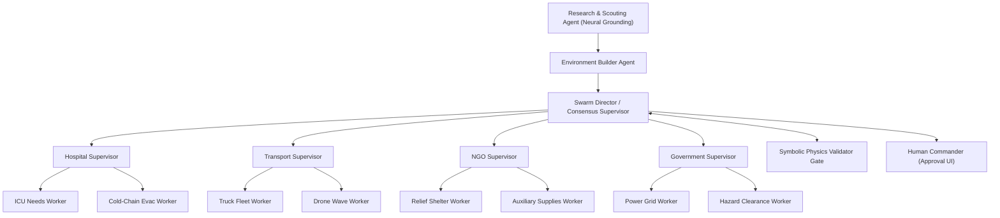

# Agent Architecture & Multi-Agent Swarm Specification — MARG v2

## Document Metadata
- **Document Title**: AGENT_ARCHITECTURE.md
- **System**: MARG v2 Crisis Intelligence Platform
- **Status**: Production Agent Specification

---

## 1. Multi-Agent Swarm Taxonomy

MARG v2 organizes AI agents into a **Supervisor-Worker Hierarchy** designed for cognitive separation of concerns.



---

## 2. Comprehensive Agent Profiles

### 2.1 Research & Scouting Agent
- **Role**: Discovers real-world disaster infrastructure and hazard geography during the initial seeding phase.
- **Inputs**: `{ state: string, city: string, crisis: string }`.
- **Tools**: Google Search Grounding API, Geocoding API.
- **Outputs**: `ScoutEnvironmentSeed` (Hospitals, depots, shelters, flooded rivers, compromised bridges).
- **Lifecycle**: Executes once during `POST /api/simulation/initialize`.

### 2.2 Environment Builder Agent
- **Role**: Converts raw web-grounded research into a structured simulation graph (`region_config`).
- **Inputs**: Output from Research & Scouting Agent.
- **Outputs**: Initialized global state dict written to Firebase RTDB.
- **Lifecycle**: Runs immediately after the Research Agent.

### 2.3 Hospital Supervisor & Workers
- **Hospital Supervisor**: Aggregates healthcare emergency logistics demands.
  - **ICU Worker**: Monitors emergency oxygen reserves, ventilator power requirements, and critical triage lists.
  - **Cold-Chain Evac Worker**: Calculates blood bank and vaccine degradation deadlines.
- **Inputs**: Crisis severity, grid power status, remaining minutes, last 6 messages from `shared_history`.
- **Outputs**: Proposals requesting cold-chain supply deliveries to specific hospital node IDs (`HOSPITAL_A`, `GMCH_HOSPITAL`).

### 2.4 Transport Supervisor & Workers
- **Transport Supervisor**: Manages vehicle fleet routing and asset deployment.
  - **Truck Fleet Worker**: Evaluates reefer truck capacities (3 trucks max), fuel ranges, and flooded road clearance.
  - **Drone Wave Worker**: Calculates short-haul drone wave capabilities (80 km/h speed, 100 units max per payload).
- **Inputs**: Fleet status, road clearance levels, distance tables, last 6 messages.
- **Outputs**: Offers or rejections specifying transport mode (`truck` vs `drone`), `from_node`, `to_node`, and quantity.

### 2.5 NGO Supervisor & Workers
- **NGO Supervisor**: Deploys community volunteer networks and auxiliary supplies.
  - **Shelter Worker**: Converts local sports stadiums and schools into emergency refugee hubs.
  - **Auxiliary Supplies Worker**: Manages dry ice pack distribution and portable solar generators.
- **Inputs**: Unmet hospital demands, ground transport bottlenecks, last 6 messages.
- **Outputs**: Offers of drone waves and dry ice shipments from NGO base nodes.

### 2.6 Government Supervisor & Workers
- **Government Supervisor**: Enforces civil defense regulations and emergency priority lanes.
  - **Power Grid Worker**: Monitors electrical sub-station outages and generator fuel allocations.
  - **Hazard Clearance Worker**: Tracks clearing operations for fallen trees, landslides, and bridge inspections.
- **Inputs**: Hazard polygon maps, infrastructure power status, last 6 messages.
- **Outputs**: Priority overrides and route clearance updates.

### 2.7 Consensus Supervisor (Swarm Director)
- **Role**: Synthesizes multi-agent negotiations into an actionable consensus plan.
- **Inputs**: Complete `shared_history`, `validated_decisions`, crisis time remaining.
- **Outputs**: `final_consensus_plan` containing `approval_status` (`APPROVED`, `MODIFIED`, `FORCED`), `executive_summary`, and `risk_flags`.
- **Constraint**: Prohibited from outputting numerical values (ETAs and quantities are derived solely from physics).

### 2.8 Symbolic Physics Validator Gate
- **Role**: Zero-AI deterministic gate validating every agent proposal against physical laws.
- **Inputs**: Candidate `AgentResponse` JSON object and current state dict.
- **Outputs**: `{ "valid": true, "error": null }` or `{ "valid": false, "error": "PHYSICS_..." }`.
- **Tools**: Google Maps Directions API, Haversine Path Engine.

### 2.9 Human Commander
- **Role**: Authoritative human-in-the-loop decision-maker.
- **Inputs**: Visualized consensus plan, interactive Google Map, risk flags.
- **Outputs**: Explicit approval command (`Review & Approve Plan`).

---

## 3. Agent Memory Architecture & Context Windowing

```
                     CONTEXT WINDOW MEMORY SLICING
                     
  [ Full Shared History (e.g. 15 Messages) ]
  ├── Message 1  (Round 1)
  ├── Message 2  (Round 1)
  │   ...
  ├── Message 10 (Round 2)
  ├── Message 11 (Round 2)  ┐
  ├── Message 12 (Round 2)  │
  ├── Message 13 (Round 3)  ├─► DETERMINISTIC SLICE (Last 6 Messages)
  ├── Message 14 (Round 3)  │   Injected into Agent Prompt
  └── Message 15 (Round 3)  ┘
```

- **Short-Term Memory**: Each working agent receives **only the last 6 messages** from `shared_history`. This deterministic slicing avoids LLM context bloat and eliminates summarization hallucination risks.
- **Episodic Memory**: The full conversation log is persisted in Firebase RTDB and Postgres for post-crisis audit trails.

---

## 4. Chain-of-Thought (CoT) Prompting Mechanics

All working agents are forced via Pydantic/JSON schemas to output an `internal_reasoning` string before selecting an action.

```text
PROMPT INSTRUCTION:
1. Think step-by-step (write your reasoning in internal_reasoning).
2. Propose ONE concrete action: request, offer, reject, hold, or resolve.
3. You MUST ALWAYS specify from_node and to_node using VALID NODE IDs.
4. Set consensus_reached=true only if you believe the current plan is viable end-to-end.
```

---

## 5. Document Cross-References
- See [SYSTEM_ARCHITECTURE.md](SYSTEM_ARCHITECTURE.md) for system context.
- See [PHYSICS_ENGINE.md](PHYSICS_ENGINE.md) for validation rules.
- See [LLM_PROVIDER.md](LLM_PROVIDER.md) for model execution setup.
