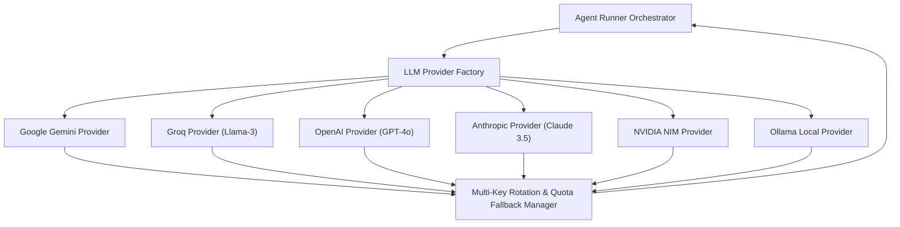

# Model-Agnostic LLM Provider Abstraction — MARG v2

## Document Metadata
- **Document Title**: LLM_PROVIDER.md
- **System**: MARG v2 Cognitive Engine
- **Status**: Production Architecture Blueprint

---

## 1. Provider Abstraction Architecture

MARG v2 decouples multi-agent business logic from specific AI vendors using a **Provider-Agnostic Model Interface**. This guarantees that switching between cloud APIs (Gemini, OpenAI, Anthropic, Groq, OpenRouter, NVIDIA NIM) or offline local models (Ollama) requires zero modifications to agent prompts or physics validation.



---

## 2. Universal Provider Interface Contract (`LLMProviderInterface`)

```python
from abc import ABC, abstractmethod
from typing import Dict, Any, Optional

class LLMProviderInterface(ABC):
    """
    Universal interface for cognitive model execution.
    Enforces structured JSON output across all supported vendors.
    """
    
    @abstractmethod
    async def generate_structured(
        self,
        prompt: str,
        json_schema: Dict[str, Any],
        system_instruction: Optional[str] = None,
        temperature: float = 0.15,
        max_tokens: int = 500
    ) -> Dict[str, Any]:
        """
        Executes prompt and returns a validated JSON dictionary matching json_schema.
        """
        pass
```

---

## 3. Supported LLM Provider Implementations

### 1. Google Gemini Provider (`gemini-2.0-flash`)
- **Native Feature**: Native `response_schema` enforcement via `google.generativeai`.
- **Search Grounding**: Native Google Search Grounding for Research Agent scouting rounds.

### 2. Groq Provider (`llama-3.3-70b-versatile`)
- **Feature**: Sub-second token generation for ultra-low latency multi-agent rounds.
- **JSON Enforcement**: `response_format={"type": "json_object"}`.

### 3. OpenAI Provider (`gpt-4o-mini` / `gpt-4o`)
- **Feature**: High-reasoning structured output via `response_format={"type": "json_schema"}`.

### 4. Anthropic Provider (`claude-3-5-sonnet`)
- **Feature**: Deep Chain-of-Thought reasoning for Swarm Director executive plan synthesis.
- **JSON Enforcement**: System prompt JSON constraint coercion.

### 5. NVIDIA NIM & OpenRouter Providers
- **Feature**: Enterprise microservice deployment and multi-model API aggregation.

### 6. Ollama Local Provider (`llama3:8b` / `qwen2.5:7b`)
- **Feature**: Air-gapped offline disaster operations when local EOC internet connectivity is lost.

---

## 4. Multi-Key Rotation & Automatic Provider Failover

```
                     PROVIDER FAILOVER CASCADE
                     
   [ Primary API Key: Gemini Key 1 ] ──(429 / Quota Error)──► Rotate Key
                                                                 │
                                                          (All Keys Exhausted)
                                                                 ▼
   [ Secondary Provider: Groq API ] ──(Connection Failure)─► Local Provider
                                                                 │
                                                                 ▼
                                                       [ Ollama Edge Model ]
```

```python
class ProviderFallbackManager:
    def __init__(self, primary_provider: LLMProviderInterface, fallback_providers: list):
        self.primary = primary_provider
        self.fallbacks = fallback_providers

    async def execute_safe(self, prompt: str, schema: dict) -> dict:
        try:
            return await self.primary.generate_structured(prompt, schema)
        except Exception as exc:
            logger.warning(f"[LLM Gateway] Primary provider failed: {exc}. Trying fallbacks...")
            for fallback in self.fallbacks:
                try:
                    return await fallback.generate_structured(prompt, schema)
                except Exception as f_exc:
                    logger.warning(f"[LLM Gateway] Fallback failed: {f_exc}")
            
            # System degraded fallback response if all LLM providers fail
            return self._build_degraded_fallback()
```

---

## 5. Document Cross-References
- See [AGENT_ARCHITECTURE.md](AGENT_ARCHITECTURE.md) for agent prompts.
- See [SYSTEM_ARCHITECTURE.md](SYSTEM_ARCHITECTURE.md) for cognitive engine setup.
