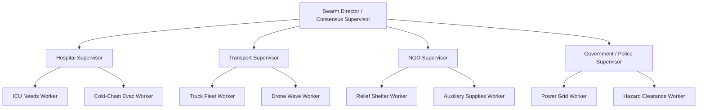

# Product Requirements Document (PRD) — MARG v2

## Document Metadata
- **Product Name**: MARG v2: National Crisis Intelligence Platform
- **Document Version**: 2.0.0
- **Status**: Production Architecture Specification
- **Owner**: Lead Product & AI Architect

---

## 1. Executive Summary & Problem Statement
During regional and national natural disasters across India (such as cyclones in Odisha/Maharashtra, urban flooding in Chennai/Guwahati, or landslides in Himachal Pradesh), Emergency Operations Centers (EOCs) face catastrophic logistical bottlenecks:
1. **Information Fragmentation**: Real-time ground data is scattered across weather advisories, social feeds, local authorities, and physical road blockage reports.
2. **Resource Misallocation**: Supplies accumulate in accessible depots while critical sites (such as ICU units in flooded hospitals) run out of oxygen and blood products.
3. **LLM Hallucination Risk**: Standard AI agents generate impossible routes, non-existent roads, and physically unviable delivery ETAs.

**MARG v2** solves this via a **Neurosymbolic Multi-Agent Swarm System**. Neural models perform dynamic web-grounded situational research and autonomous negotiation, while a deterministic symbolic physics gate enforces real-world road network constraints via Google Maps APIs.

---

## 2. Target Audience & User Journeys

### User Journey 1: Regional Crisis Deployment (Human Commander)
```
[State/City Selection] ──► [Crisis Context Ingestion] ──► [Web Scouting Round]
                                                                  │
                                                                  ▼
[Human Approval Gate] ◄── [Consensus Plan Generation] ◄── [Supervisor-Worker Negotiation]
```
1. **Initiation**: Commander selects state (e.g., *Assam*) and district/city (e.g., *Guwahati*) and submits a narrative crisis report.
2. **Automated Discovery**: Research Engine initiates Google Search Grounding to extract active flood zones, tertiary hospital coordinates, supply depots, and emergency relief nodes.
3. **Swarm Execution**: Multi-agent swarm (Hospital, Transport, NGO, Government) negotiates route and resource handoffs over 3 automated rounds.
4. **Physics Validation**: Every candidate route polyline and ETA is validated against real road networks and hazard intersection bounds.
5. **Human Approval**: Commander inspects the validated consensus plan, reviews risk flags, and clicks **Approve & Execute**.

---

## 3. Agent Taxonomy: Supervisor & Worker Architecture

MARG v2 replaces the prototype's single-layer agent roster with a **Hierarchical Supervisor-Worker Architecture**.



### 1. Swarm Director (Consensus Supervisor)
- **Role**: Coordinates top-level swarm synthesis and arbitrates deadlocks.
- **Inputs**: Consolidated proposals from domain supervisors, time remaining, simulation status.
- **Outputs**: Executive plan summary, risk flags, approval status (`APPROVED`, `MODIFIED`, `FORCED`).
- **Tools**: Plan Synthesis Engine, Conflict Detector.

### 2. Hospital Domain
- **Hospital Supervisor**: Aggregates emergency hospital supply demands across the affected district.
  - **ICU Needs Worker**: Monitors ventilator power, emergency oxygen reserves, and critical patient triage.
  - **Cold-Chain Evac Worker**: Tracks temperature-sensitive medicine/blood spoilage countdowns and cold storage requirements.

### 3. Logistics & Transport Domain
- **Transport Supervisor**: Manages ground and aerial vehicle dispatch.
  - **Truck Fleet Worker**: Evaluates reefer truck load capacities, fuel ranges, and flooded road clearance.
  - **Drone Wave Worker**: Calculates short-haul drone payload limits (100 units max) and aerial corridor flight times.

### 4. NGO & Relief Domain
- **NGO Supervisor**: Mobilizes volunteer networks and emergency relief materials.
  - **Relief Shelter Worker**: Coordinates stadium and school converter shelters for displaced citizens.
  - **Auxiliary Supplies Worker**: Allocates dry ice packs, portable solar generators, and water purification units.

### 5. Government & Infrastructure Domain
- **Government Supervisor**: Enforces civil defense regulations and priority lane access.
  - **Power Grid Worker**: Reports sub-station outage boundaries and diesel generator allocation.
  - **Hazard Clearance Worker**: Updates road clearance operations and bridge safety clearance.

---

## 4. Comprehensive Feature Specifications

| Feature ID | Feature Name | Description | Priority |
| :--- | :--- | :--- | :--- |
| **FEAT-01** | Dynamic National Selection | UI dropdown allowing selection of any State & City across India with custom crisis narrative. | P0 |
| **FEAT-02** | Web Grounded Scouting | Autonomous research agent queries Google Search to discover real infrastructure nodes & hazard bounds. | P0 |
| **FEAT-03** | Google Maps Routing Gate | Real-time pathing via Directions API replacing static distance matrices with actual road polylines. | P0 |
| **FEAT-04** | Provider-Agnostic LLM Engine | Unified interface supporting Gemini, Groq, OpenRouter, Anthropic, OpenAI, and Ollama. | P0 |
| **FEAT-05** | Realtime Firebase Sync | Sub-200ms WebSocket updates pushing agent history, map lines, and decision cards to UI. | P0 |
| **FEAT-06** | CoT Debug Panel | Expandable UI component rendering `internal_reasoning` traces for transparency. | P1 |
| **FEAT-07** | Automated Cron Session Cleanup| Scheduled serverless background job purging expired RTDB session trees after 1 hour TTL. | P1 |
| **FEAT-08** | Multi-Key API Rotation | Automatic failover to backup LLM API keys upon encountering rate limits (HTTP 429). | P0 |

---

## 5. Non-Functional Requirements (NFRs)

```
                       PERFORMANCE & RELIABILITY TARGETS
                       
┌──────────────────────┐    ┌──────────────────────┐    ┌──────────────────────┐
│  Max Scouting Latency│    │  Firebase Sync Speed │    │   Physics Accuracy   │
│      < 8.0 Seconds   │    │     < 200 ms         │    │   100% Deterministic │
└──────────────────────┘    └──────────────────────┘    └──────────────────────┘
```

1. **Performance & Latency**:
   - Web scouting & infrastructure discovery: $< 8.0$ seconds.
   - Per-agent reasoning round: $< 12.0$ seconds.
   - End-to-end multi-agent negotiation (3 rounds): $< 45.0$ seconds.
2. **Reliability & Availability**:
   - System Uptime Target: 99.9% availability on cloud serverless infrastructure.
   - LLM Failover: Auto-rotation across backup API keys within $< 500\text{ms}$ upon encountering rate limits or quota exhaustion.
3. **Security & Data Integrity**:
   - Zero hardcoded API keys in client bundles.
   - Strict Zod schema validation on Node.js gateway and Pydantic parsing on Python engine.
   - CORS restriction enforcing authorized origin patterns.

---

## 6. Success Metrics & Acceptance Criteria

### Key Performance Indicators (KPIs)
- **Zero Physics Violations**: $0\%$ of finalized plans presented to commanders violate road clearance or asset payload limits.
- **Geographic Adaptability**: $100\%$ successful scouting seeding across test scenarios in North, South, East, and West India.
- **Negotiation Convergence Rate**: $> 90\%$ of multi-agent runs reach organic consensus within 3 rounds.

---

## 7. Document Cross-References
- See [BRD.md](BRD.md) for business objectives and stakeholder alignment.
- See [AGENT_ARCHITECTURE.md](AGENT_ARCHITECTURE.md) for deep agent prompt specs.
- See [DATA_MODEL.md](DATA_MODEL.md) for complete schema definitions.
