# MARG v2: Project Vision & Strategic Intent

## Executive Summary
**M.A.R.G. (Multi-Agent Routing and Guidance)** is evolving from a hackathon prototype into **MARG v2: National Crisis Intelligence Platform**—an open-source, neurosymbolic multi-agent disaster coordination engine. MARG v2 unifies neural intelligence (LLM agents with real-world search grounding) and symbolic determinism (physics engines, road graph verification, asset constraints) to assist emergency operations centers (EOCs), NGOs, and first responders across India during severe crises.

---

## 1. Project Mission
To eliminate logistical delays and resource misallocations during humanitarian crises by deploying autonomous, multi-agent AI swarms that continuously negotiate, physically validate, and present human-executable emergency response plans in real time.

---

## 2. Long-Term Vision
To become the global open-source standard for AI-driven disaster response and multi-agent spatial coordination. MARG v2 aims to empower national disaster management agencies (such as India's NDMA and State SDMAs) with instant, web-grounded situational awareness and dynamic logistics routing across any state, district, or city in India within seconds of crisis onset.

---

## 3. Core Architectural Evolution: MARG v1 vs MARG v2

```mermaid
graph TD
    subgraph MARG_v1 ["MARG v1 (Hackathon Prototype)"]
        V1_Front["Hardcoded React Dashboard"] --> V1_Node["Express Orchestrator"]
        V1_Node --> V1_Py["FastAPI + Gemini 2.0"]
        V1_Py --> V1_Physics["Static Distance Matrix (14 pairs)"]
        V1_Physics --> V1_RTDB["Firebase RTDB"]
        V1_Front -. "Fixed Maharashtra Map" .-> V1_Front
    end

    subgraph MARG_v2 ["MARG v2 (Production Platform)"]
        V2_Front["Dynamic React + Vite Landing & Command Center"] --> V2_Gate["Node.js Gateway / Vercel Serverless"]
        V2_Gate --> V2_Research["Web Search & Grounding Engine"]
        V2_Research --> V2_World["World Model Builder (Postgres + Redis)"]
        V2_World --> V2_Swarm["Supervisor-Worker Swarm (Provider-Agnostic LLM)"]
        V2_Swarm <--> V2_Physics["Dynamic Symbolic Physics Gate (Google Maps API)"]
        V2_Swarm --> V2_RTDB["Firebase RTDB (Realtime UI Sync)"]
    end
```



| Feature Dimension | MARG v1 (Hackathon Base) | MARG v2 (Production Target) |
| :--- | :--- | :--- |
| **Geographic Scope** | Hardcoded 5-node slice in Coastal Maharashtra | Any State, District, or City across India |
| **Crisis Scenario** | Hardcoded Cyclone Grid Failure | Dynamic discovery via user input or live news/weather feeds |
| **Node Infrastructure** | 5 static predefined locations (`nodes.js`) | Dynamic discovery via Google Places & Web Grounding |
| **Physics Verification** | Static 14-pair lookup matrix (`NODE_DISTANCES`) | Real road polylines & ETAs via Google Maps Directions API |
| **LLM Provider** | Bound directly to Google Gemini 2.0 Flash | Provider-agnostic interface (Gemini, Groq, Anthropic, OpenAI, Ollama) |
| **Agent Hierarchy** | Single flat working roster + Director | Supervisor-Worker hierarchy with specialized domain tools |
| **Execution Trigger** | Manual step-by-step UI button clicks | Automated continuous negotiation with human approval gate |

---

## 4. Strategic Goals & Non-Goals

### Strategic Goals
- **Dynamic Seeding**: Discover infrastructure hubs, hospitals, relief camps, and hazard boundaries anywhere in India within 10 seconds of input.
- **Symbolic Integrity**: Guarantee that 100% of recommendations presented to human commanders strictly obey physical, topological, and capacity constraints.
- **Provider Interoperability**: Support seamless fallback and hybrid agent execution across multiple LLM APIs or local models.
- **Low-Latency UI Sync**: Deliver sub-200ms real-time map and chat updates to first responders via Firebase RTDB.

### Non-Goals
- **Fully Autonomous Execution**: MARG will **NEVER** dispatch physical vehicles or assets without explicit human commander approval (Human-in-the-Loop requirement).
- **Medical Diagnosis**: MARG does not diagnose patients; it exclusively handles logistical and resource allocation workflows.
- **Military Command**: MARG is built strictly for humanitarian emergency relief and civil defense.

---

## 5. User Personas

```
┌───────────────────────────┐    ┌───────────────────────────┐    ┌───────────────────────────┐
│     HUMAN COMMANDER       │    │    LOGISTICS DIRECTOR     │    │     FIELD NGO RESPONSE    │
│  State/District EOC Lead  │    │  Transport Fleet Officer  │    │  Red Cross / Relief Squad │
│  - Approves final plans   │    │  - Monitors truck/drone   │    │  - Views dynamic maps &   │
│  - Sets priority overrides│    │    capacities & routes    │    │    supply ETA countdowns  │
└───────────────────────────┘    └───────────────────────────┘    └───────────────────────────┘
```

1. **Human Commander (State EOC Lead)**: Requires high-level executive summaries, risk flags, and an authoritative single button to approve synthesized action plans.
2. **Logistics Officer (District Transport Agency)**: Needs granular route breakdowns, vehicle load limits, real-time ETA updates, and bottleneck alerts.
3. **Field NGO Coordinator**: Relies on real-time mobile/web dashboards showing nearby distribution waypoints, drone drop zones, and medical supply countdowns.

---

## 6. Product Philosophy & Guiding Principles
- **Neurosymbolic Synergy**: Neural LLMs provide creative problem-solving and natural communication; Symbolic code enforces physical laws, safety bounds, and routing accuracy.
- **Zero Hallucination Tolerance**: No LLM-generated GPS coordinate or hallucinated distance is ever rendered to the user without passing the symbolic physics gate.
- **Human-Centric Control**: AI swarms negotiate and optimize; human commanders decide and command.

---

## 7. Document Cross-References
- See [PRD.md](PRD.md) for functional requirements and user journeys.
- See [SYSTEM_ARCHITECTURE.md](SYSTEM_ARCHITECTURE.md) for component topology.
- See [ROADMAP.md](ROADMAP.md) for long-term development milestones.
