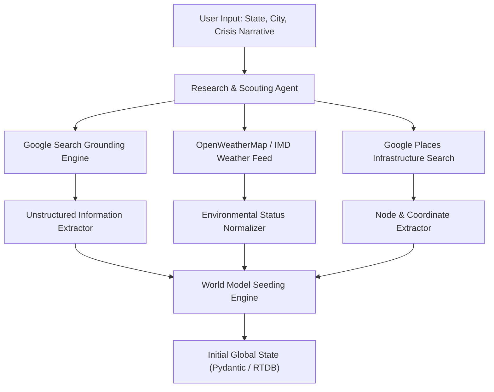

# Autonomous Research & Grounding Engine — MARG v2

## Document Metadata
- **Document Title**: RESEARCH_ENGINE.md
- **System**: MARG v2 Intelligence Layer
- **Status**: Production Blueprint

---

## 1. Research Engine Architecture

The Research Engine automatically converts unstructured regional disaster reports into a structured simulation environment graph.



---

## 2. Search Grounding & Web Research Pipeline

1. **Grounding Execution**:
   - Executes dynamic web search queries combining regional geography with disaster parameters.
   - Example Query: `"Current flood status Assam Guwahati medical supply depots government hospital operational status"`.
2. **Entity Extraction**:
   - Identifies major government hospitals, regional supply hubs, convention centers, flooded river basins, and destroyed bridges.
3. **Structured Pydantic Parsing**:
   - Extracted entities are parsed into `ScoutEnvironmentSeed` containing node IDs, human labels, GPS coordinates, capacity limits, and geofenced hazard boundaries.

---

## 3. Real-Time External Data Source Integrations

| Data Source | Ingestion Method | Extracted Information | Frequency |
| :--- | :--- | :--- | :--- |
| **Google Search Grounding** | Gemini Tool Call API | Infrastructure status, active hazard news, road closures | Initial Scouting Round |
| **Google Places API** | REST API (Text Search) | Lat/Lng coordinates & official names for regional hubs | Initial Scouting Round |
| **Weather APIs (IMD/OpenWeather)**| REST API | Wind speed, rainfall rate, flood severity multiplier | Periodic background sync |
| **OpenStreetMap / Directions** | REST API | Road polyline geometries, bridge height/weight clearances | On-demand physics check |

---

## 4. Knowledge Graph Seeding & Conversion

```
                      UNSTRUCTURED TO GRAPH SEEDING
                      
  Unstructured Text: "Gauhati Medical College hospital is low on oxygen. 
                      Khanapara cold storage is operational. GS Road bridge flooded."
                                      │
                                      ▼
  [ Pydantic Extraction ] ──► Node Graph Construction
                                      │
  ┌───────────────────────────────────┴───────────────────────────────────┐
  │ • Node(GMCH_HOSPITAL): { type: "hospital", status: "critical" }       │
  │ • Node(KHANAPARA_DEPOT): { type: "coldStorage", status: "operational" }│
  │ • Hazard(GS_ROAD_FLOOD): { type: "flooded_zone", speed_mult: 0.2 }    │
  └───────────────────────────────────────────────────────────────────────┘
```

---

## 5. Document Cross-References
- See [DATA_MODEL.md](DATA_MODEL.md) for seed state schemas.
- See [AGENT_ARCHITECTURE.md](AGENT_ARCHITECTURE.md) for Research Agent specs.
