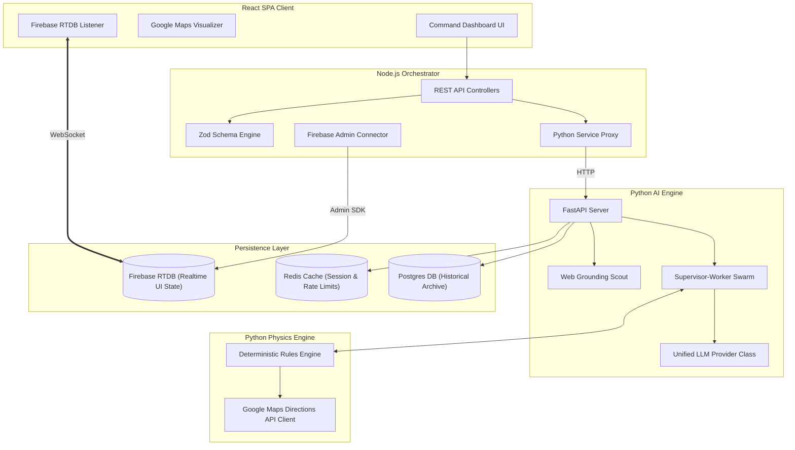

# Software Design Document (SDD) — MARG v2

## Document Metadata
- **Document Title**: Software Design Document (SDD) for MARG v2
- **System**: MARG v2 Crisis Intelligence Engine
- **Status**: Production Specification

---

## 1. High-Level System Architecture & Component Decomposition

MARG v2 is constructed around a **Neurosymbolic Dual-Engine Core** integrated with a distributed data storage architecture (Postgres, Redis, Firebase RTDB).



---

## 2. Database & Data Store Schemas

### 2.1 Firebase Realtime Database (RTDB) Layout
- **Path**: `/sessions/{session_id}/state`
- **Role**: Ephemeral real-time synchronization buffer between Node orchestrator and React client.

```json
{
  "session_id": "STRING (UUID v4)",
  "round_number": "INTEGER",
  "status": "ENUM ('running', 'consensus_reached', 'forced_resolution', 'degraded')",
  "region_config": {
    "state": "STRING",
    "city": "STRING",
    "map_center": { "lat": "FLOAT", "lng": "FLOAT" },
    "map_zoom": "INTEGER",
    "nodes": {
      "NODE_ID": {
        "label": "STRING",
        "type": "ENUM ('hospital', 'transport', 'waypoint', 'coldStorage', 'ngo')",
        "lat": "FLOAT",
        "lng": "FLOAT",
        "status": "STRING"
      }
    },
    "hazards": [
      {
        "id": "STRING",
        "label": "STRING",
        "type": "STRING",
        "polygon": [{ "lat": "FLOAT", "lng": "FLOAT" }],
        "stroke_color": "STRING",
        "fill_color": "STRING",
        "fill_opacity": "FLOAT"
      }
    ]
  },
  "crisis": {
    "type": "STRING",
    "location": "STRING",
    "severity": "STRING",
    "time_remaining_minutes": "INTEGER",
    "grid_status": "STRING",
    "road_status": "STRING"
  },
  "agents": "RECORD (Agent Profiles)",
  "shared_history": "ARRAY (Agent Messages)",
  "validated_decisions": "ARRAY (Validated Transport Steps)",
  "conflicts": "ARRAY",
  "final_consensus_plan": "OBJECT / NULL",
  "system_message": "STRING / NULL"
}
```

### 2.2 Redis In-Memory State & Cache Layout
- **Session Cache**: `session:{session_id}:state` (JSON stringified global state, TTL: 3600s).
- **Rate Limit Counter**: `ratelimit:{ip}:run-round` (Integer counter, TTL: 60s).
- **LLM Key Quota Tracker**: `llm:key:{key_hash}:quota` (Boolean availability flag).

### 2.3 Postgres Relational Database Schema (Production Archive)
```sql
CREATE TABLE crisis_sessions (
    session_id UUID PRIMARY KEY DEFAULT gen_random_uuid(),
    created_at TIMESTAMP WITH TIME ZONE DEFAULT CURRENT_TIMESTAMP,
    state_name VARCHAR(100) NOT NULL,
    city_name VARCHAR(100) NOT NULL,
    crisis_type VARCHAR(100) NOT NULL,
    final_status VARCHAR(50) NOT NULL,
    total_rounds INTEGER NOT NULL,
    time_taken_seconds FLOAT NOT NULL
);

CREATE TABLE agent_decisions (
    decision_id UUID PRIMARY KEY DEFAULT gen_random_uuid(),
    session_id UUID REFERENCES crisis_sessions(session_id) ON DELETE CASCADE,
    round_number INTEGER NOT NULL,
    agent_name VARCHAR(50) NOT NULL,
    action VARCHAR(50) NOT NULL,
    proposed_transport VARCHAR(50),
    from_node VARCHAR(100),
    to_node VARCHAR(100),
    quantity INTEGER,
    eta_minutes INTEGER,
    physics_passed BOOLEAN NOT NULL,
    physics_error TEXT,
    created_at TIMESTAMP WITH TIME ZONE DEFAULT CURRENT_TIMESTAMP
);
```

---

## 3. Inter-Service API Contracts

### 3.1 Node Orchestrator $\leftrightarrow$ Python Engine Contract (`POST /simulate/round`)
- **Request Body**:
```json
{
  "state": {
    "session_id": "c9a4b2e8-5f12-4d3a-9e11-8f2a4b6c8d10",
    "round_number": 1,
    "status": "running",
    "crisis": { ... },
    "agents": { ... },
    "shared_history": [ ... ]
  }
}
```
- **Response Body (200 OK)**: Complete mutated global state dictionary.

---

## 4. Unified LLM Provider Interface Class Design

```python
from abc import ABC, abstractmethod
from typing import Dict, Any, Type, Optional
from pydantic import BaseModel

class LLMProviderInterface(ABC):
    """
    Abstract base class for all LLM providers (Gemini, Groq, OpenAI, Anthropic, Ollama).
    Guarantees provider-agnostic execution for swarm agents.
    """
    
    @abstractmethod
    async def generate_structured(
        self,
        prompt: str,
        response_schema: Dict[str, Any],
        system_instruction: Optional[str] = None,
        temperature: float = 0.15,
        max_tokens: int = 500
    ) -> Dict[str, Any]:
        """
        Executes a prompt against the provider and enforces structured JSON output.
        Returns parsed dictionary matching response_schema.
        """
        pass

    @abstractmethod
    async def generate_with_search_grounding(
        self,
        prompt: str,
        system_instruction: Optional[str] = None
    ) -> Dict[str, Any]:
        """
        Executes a prompt with real-time web search grounding enabled.
        """
        pass
```

---

## 5. Document Cross-References
- See [SYSTEM_ARCHITECTURE.md](SYSTEM_ARCHITECTURE.md) for system architecture overview.
- See [LLM_PROVIDER.md](LLM_PROVIDER.md) for provider implementations.
- See [API_SPECIFICATION.md](API_SPECIFICATION.md) for full REST/WebSocket contracts.
