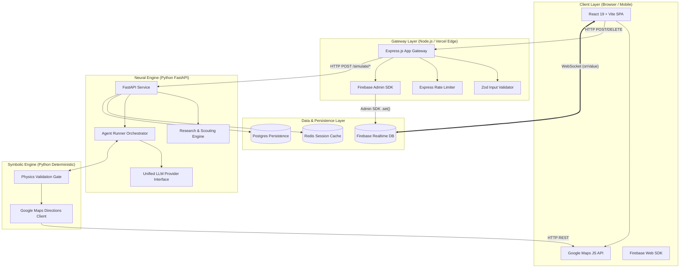

# System Architecture & Technical Design — MARG v2

## Document Metadata
- **Document Title**: SYSTEM_ARCHITECTURE.md
- **Platform**: MARG v2 National Crisis Intelligence Engine
- **Status**: Production Blueprint

---

## 1. High-Level Architecture Topology

MARG v2 uses a **Decoupled Monorepo Architecture** separating static asset serving, API orchestration, research grounding, neural multi-agent reasoning, symbolic validation, and real-time state synchronization.



---

## 2. Component System Inventory

### 1. Client Layer (`frontend/`)
- **Technology**: React 19, Vite, Tailwind CSS, `@react-google-maps/api`, `firebase/database`.
- **Role**: Renders live tactical dashboard, dynamic map layers (node markers, polylines, flood polygons), agent chat feeds, CoT debug trays, countdown timers, and decision approval cards.
- **Data Flow**: Connects to Node Gateway via REST HTTP and subscribes to Firebase RTDB via WebSocket.

### 2. Gateway & Orchestrator Layer (`backend-node/`)
- **Technology**: Node.js, Express.js, `firebase-admin`, `zod`, `express-rate-limit`, `helmet`.
- **Role**: Serves as security boundary and API proxy. Initializes sessions, enforces request schemas, proxies state payloads to Python engine, handles fallback degraded states, and executes atomic RTDB state updates.

### 3. Neural Cognitive Engine (`backend-python/`)
- **Technology**: Python 3.11+, FastAPI, Uvicorn, Pydantic, `google-generativeai`, `httpx`.
- **Role**: Houses research scouting agents, prompt assembly engines, multi-agent negotiation loops, context compression (last 6 history items), and unified LLM provider interfaces.

### 4. Symbolic Physics Gate (`backend-python/physics/`)
- **Technology**: Pure Python (Deterministic, Zero-AI).
- **Role**: Validates agent proposals against physical rules (GPS coordinate injection, power status, drone payload limits, road distances, spoilage deadlines). Integrates Google Maps Directions API for dynamic route verification.

### 5. Persistence Layer
- **Firebase RTDB**: Ephemeral real-time state synchronization buffer (`/sessions/{session_id}/state`).
- **Redis**: Session state cache and rate-limit counter store (Production Target).
- **Postgres**: Historical simulation archive, agent evaluation logs, and audit trails (Production Target).

---

## 3. Sequenced Data Flow: Initialization to Execution

```
   Client (React)       Node Gateway         Python Engine        Physics Gate       Firebase RTDB
         │                   │                     │                   │                   │
         │-- POST /init ---->│                     │                   │                   │
         │                   │-- POST /scout ----->│                   │                   │
         │                   │                     │-- Search Ground ->│                   │
         │                   │                     │<-- Seed Data -----│                   │
         │                   │<-- Initial State ---│                   │                   │
         │                   │-- writeSessionState ───────────────────────────────────────>│
         │<-- 201 Session ID -│                     │                   │                   │
         │                   │                     │                   │                   │
         │<================== WebSocket Push (Initial Seed State) ========================│
         │                   │                     │                   │                   │
         │-- POST /run ----->│                     │                   │                   │
         │                   │-- POST /simulate -->│                   │                   │
         │                   │                     │-- Validate Proposal ->│               │
         │                   │                     │<-- Physics Result ----│               │
         │                   │                     │ (Retry if needed) │               │
         │                   │<-- Mutated State ---│                   │                   │
         │                   │-- writeSessionState ───────────────────────────────────────>│
         │<-- 200 OK --------│                     │                   │                   │
         │                   │                     │                   │                   │
         │<================== WebSocket Push (Updated Round State) =======================│
```

---

## 4. Technology Decisions & Tradeoff Analysis

| Component | Selected Technology | Alternative Evaluated | Tradeoff Rationale |
| :--- | :--- | :--- | :--- |
| **Realtime Sync** | Firebase RTDB | Socket.io / WebSockets Server | Firebase handles connection pooling, reconnection backoff, and state persistence out-of-the-box with zero custom server state code. |
| **Gateway Proxy** | Express.js / Node.js | Next.js API Routes | Node Express provides lightweight, dedicated serverless routing with granular middleware control (Zod, Rate Limits). |
| **Neural Engine** | FastAPI (Python) | Node.js LangChain | Python offers superior ecosystem support for Pydantic models, async AI agent frameworks, and scientific computing integrations. |
| **Map Rendering** | `@react-google-maps/api` | Leaflet / Mapbox GL | Native Google Maps JS SDK integrates seamlessly with Directions API polylines and Places discovery. |

---

## 5. Migration Path: MARG v1 to MARG v2

### Phase 1: Gateway & Schema Unification (Current Base)
- Maintain current Express and FastAPI backend contracts.
- Upgrade Zod and Pydantic validation schemas to accept dynamic location parameters.

### Phase 2: Dynamic Seeding & Google Maps Integration
- Replace hardcoded `nodes.js` with dynamic `ScoutEnvironmentSeed` generator powered by Gemini Search Grounding.
- Replace static `NODE_DISTANCES` matrix in `physics_engine.py` with dynamic Google Maps Directions API queries.

### Phase 3: Provider-Agnostic LLM Layer & Redis Integration
- Implement `LLMProviderInterface` supporting Groq, OpenAI, and Anthropic fallbacks.
- Integrate Redis for rate-limiting and session state caching.

---

## 6. Document Cross-References
- See [PROJECT_VISION.md](PROJECT_VISION.md) for strategic overview.
- See [PRD.md](PRD.md) for feature specifications.
- See [DATA_MODEL.md](DATA_MODEL.md) for schema mappings.
- See [PHYSICS_ENGINE.md](PHYSICS_ENGINE.md) for symbolic validation details.
